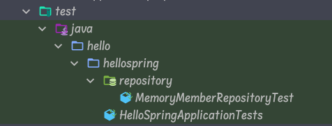

# 테스트 케이스 작성

---

개발한 기능을 실행해서 테스트 할 때, 자바의 main 메서드를 통해서 실행하거나, 웹 애플리케이션의 컨트롤러를 통해서 해당 기능을 실행한다. 이러한 방법은 준비하고 실행하는데 오래 걸리고, 반복 실행하기 어렵고 여러 테스트를 한번에 실행하기 어렵다는 단점이 있다. 자바는 JUnit이라는 프레임워크로 테스트를 실행해서 이러한 문제를 해결한다.

### 회원 리포지토리 메모리 구현체 테스트



test → java → hello →hellospring → repository package생성 → MemoryMemberRepositoryTest.class 생성

### 1 . MemoryMemberRepository 객체 생성

---

```java
lass MemoryMemberRepositoryTest {

    MemoryMemberRepository repository = new MemoryMemberRepository();
}
```

### 2. Save 메소드 Test

---

```java
@Test
    public void save(){
        Member member = new Member();
        member.setName("spring");

        repository.save(member);
        Member result = repository.findById(member.getId()).get();
        //assertThat(member).isEqualTo(result);
        //Assertions.assertEquals(member,result);
        //System.out.println("result = " + (result==member)); soutv
    }
```

- `Assertion.assertEquals()` 를 사용하거나 `Assertions.assertThat().isEqualTo`  사용

### 3.findByName 메소드 Test

---

```java
@Test
    public void findByName(){
        Member member1 = new Member();
        member1.setName("spring1");
        repository.save(member1);

        Member member2 = new Member();
        member2.setName("spring2");
        repository.save(member2);

        Member result = repository.findByName("spring1").get();
        Assertions.assertThat(result).isEqualTo(member1);
    }
```

- `member1,member2` 객체를 생성 후, `setName()` 으로 `spring1, spring2`로 지정
- `Assertions.assertThat(result).isEqualTo(member1);` 으로 `member1`의 이름이 `spring1`과 같은지 확인

### 4. findAll 메소드 Test

---

```java
@Test
    public void findAll(){
        Member member1 = new Member();
        member1.setName("spring1");
        repository.save(member1);

        Member member2 = new Member();
        member2.setName("spring1");
        repository.save(member2);

        List<Member> result = repository.findeAll();
        Assertions.assertThat(result.size()).isEqualTo(2);
    }
```

- 위에 내용과 동일

### ❗ 이슈

---

- 메소드 별 Run을 하게되면 오류는 안나지만 class를 Run할 경우 오류 발생
1. `MemoryMemberRepository class` 내부에 `clearStore` 매소드 생성

```java
public void clearStore(){
        store.clear();
    }
```

1.  `MemoryMemberRepositoryTest` 내부에 테스트마다 초기화 메소드 생성

```java
@AfterEach
    public void afterEach(){
        repository.clearStore();
    }
```

### 완성된 코드

---

```java
package hello.hellospring.repository;

import hello.hellospring.domain.Member;
import org.assertj.core.api.Assertions;
import org.junit.jupiter.api.AfterEach;
import org.junit.jupiter.api.Test;

import java.util.List;

class MemoryMemberRepositoryTest {

    MemoryMemberRepository repository = new MemoryMemberRepository();
    @AfterEach
    public void afterEach(){
        repository.clearStore();
    }

    @Test
    public void save(){
        Member member = new Member();
        member.setName("spring");

        repository.save(member);
        Member result = repository.findById(member.getId()).get();
        //assertThat(member).isEqualTo(result);
        //Assertions.assertEquals(member,result);
        //System.out.println("result = " + (result==member)); soutv
    }
    @Test
    public void findByName(){
        Member member1 = new Member();
        member1.setName("spring1");
        repository.save(member1);

        Member member2 = new Member();
        member2.setName("spring2");
        repository.save(member2);

        Member result = repository.findByName("spring1").get();
        Assertions.assertThat(result).isEqualTo(member1);
    }
    @Test
    public void findAll(){
        Member member1 = new Member();
        member1.setName("spring1");
        repository.save(member1);

        Member member2 = new Member();
        member2.setName("spring1");
        repository.save(member2);

        List<Member> result = repository.findeAll();
        Assertions.assertThat(result.size()).isEqualTo(2);
    }
}
```