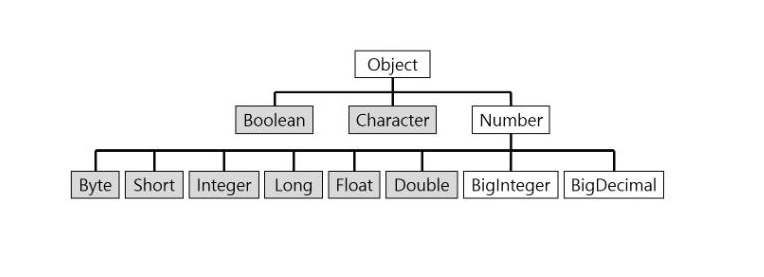
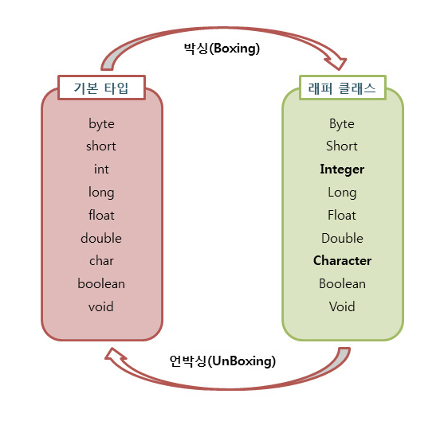

---

## 1. 개요

### Wraaper

- 포장지

### 래퍼 클래스는 원시 Java 유형을 캡슐화  하는 객체

- 캡슐화란?
    
    외부에서 객체접근하는데 있어서 정보를 숨기고 객체의 연산을 통해서만 접근이 가능하게 하는 것
    
    ```java
    public class member {
    
    	private String id;
    	private String pw;
    	private int age;
    
    	//getter
    	public String getId() {
    		return id;
    	}
    	public String getPw() {
    		return pw;
    	}
    	public int getAge() {
    		return age;
    	}
    
    	//setter
    	public void setId(String id) {
    		this.id = id;
    	}
    	public void setPw(String pw) {
    		this.pw = pw;
    	}
    	public void setAge(int age) {
    		this.age = age;
    	}
    }
    ```
    

| 기본타입(Primitive type) | 래퍼클래스(Wrapper class) |
| --- | --- |
| byte | Byte |
| char | Character |
| int | Integer |
| float | Float |
| double | Double |
| boolean | Boolean |
| long | Long |
| short | Short |



java.lang 패키지에 정의되어 있어 수동으로 가져올 필요가 없음

## 2.래퍼 클래스

### *래퍼 클래스의 목적이 무엇인가?*

→ 제네릭 클래스는 객체에서만 작동하며 기본 요소를 지원하지 않음

→ 작업하기를 원하면 원시 값을 래퍼 객체로 변환해야 함

- 제네릭클래스란?
    
    ```java
    //제네릭 클래스
    
    public class Box<T> { // T는 타입을 의미한다.
    
    private T data;
    
    public void set(T data) { 
    this.data = data; 
    	}
    
    public T get() { 
    return data; 
    	}
    }
    
    ```
    

예)

- 예전 Java 5이전엔 원시 값을 해당 래퍼 클래스로 수동으로 변환하고 컬렉션에 저장해야만 했음
- Java Collection Framework는 객체와 독점적으로 작동함
- 오늘날은 `autoboxing`을 사용하면 `ArrayList.add(101)`를 쉽게 수행할 수 있지만
    
    내부적으로 Java는 `valueOf()`메서드를 사용하여 ArrayList에 저장하기 전에 기본 값을 `Integer`로 변환함
    

## 3.원시에서 래퍼 클래스로의 변환

*“기본 값을 해당 래퍼 클래스로 변환하는 방법(예: `int`를 `Integer`로 또는 `char`에서 `Character`로 변환)으로 변환하는 방법은 무엇인가?”*

→ 생성자 또는 정적 팩토리 메소드를 사용하여 원시 값을 래퍼 클래스의 객체로 변환할 수 있음

<aside>
✔️ Java 9부터 `Integer` 또는 `Long`과 같은 많은 `boxed` 프리미티브에 대한 생성자는 사용되지 않음

</aside>

Java에서 `int`값을 `Integer` 객체로 변환하는 예)

```java
Integer object = new Integer(1);

Integer anotherObject = Integer.valueOf(1);
```

- `valueOf()`메서드는 지정된 `int`값을 나타내는 인스턴스를 반환

`String`을 `Integer`로 변환해야하는 경우 `String`이 래퍼 클래스가 아니기 때문 `parseInt()`메서드 사용

래퍼 객체에서 기본 값으로 변환하려면 `intValue()`, `doubleValue()`등 메서드 사용

```java
int val = object.intValue();
```

## 4. 오토박싱과 언박싱

Java 5이후 `autoboxiong` 및 `unboxing` 기능을 사용하여 변환을 자동으로 수행 할 수 있음



### autoboxing

- 기본 값을 해당 래퍼 객체로 변환하는 것
- 컴파일러가 `Object Data`를 `primitive Date`로 자동변환 하는 것
    - 자동으로 발생 할 수 있어서 `autoboxing`이라 함
- 예시)
    
    ```java
    public class prac{
        public static void main(String[] args)  {
            Integer num = 17; // 자동 박싱
            int n = num; //자동 언박싱
            System.out.println(n);
        }
    }
    ```
    

### unboxing

- 래퍼 객체가 기본 값으로 언래핑되는 것
- 예시)
    
    ```java
    ublic class prac {
    	public static void main(String[] args) {
    		int i1 = 10;
    		Integer wi = i1; // 오토 박싱
    		int i2 = wi; // 오토 언박싱
    		
    		double d1 = 3.14;
    		Double wd = d1; // 오토 박싱
    		double d2 = wd; // 오토 언박싱
    		
    		boolean b1 = true;
    		Boolean wb = b1; // 오토 박싱
    		boolean b2 = wb; // 오토 언박싱
    	}
    }
    ```