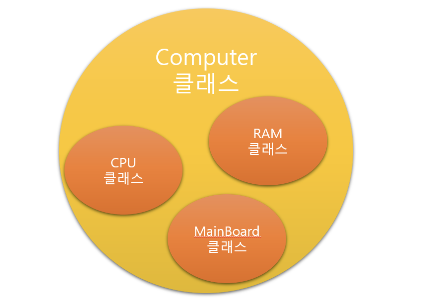

# ****Core Java Examples****

## **Java toString() Method**

<aside>
🔥 `toString()` 메서드는 객체가 가지고 있는 정보나 값들을 문자열로 만들어 리턴하는 메소드

</aside>

- `Object`클래스를 상속받은 클래스들은 `toString()`을 **오버라이딩**(재정의)하여 사용할 수 있다.
- `String`이나 `Integer`클래스에는 `toString()`이 이미 재정의 되어 있다
- `Arrays.toString()` : 파라미터로 지정한 배열의 내용을 문자열 타입으로 데이터로 반환해주는 메서드
- 객체가 완전히 `wrapper`, `collections` 또는 *`StringBuffer`* 로 구성된 경우 이러한 객체가 이미 의미 있는 표현으로 *toString()* 메서드를 **재정의**했기 때문에 사용자 지정 `toString()`구현이 필요하지 않습니다.

# ****Advanced Java Examples****

## **Composition, Aggregation, and Association in Java**

### 구성 (’소속’ 유형의 관계)

<aside>
🔥 객체 중 하나가 다른 객체를 포함하는 논리적으로 더 큰 구조임을 의미 즉, 다른 개체의 일부또는 구성원

</aside>

- 상속인 “`is-a`” 관계와 반대되는 “`has-a`” 관계라고도 부른다.
- has-a 관계 (가지고-있는)
    - 쉽게 말해서 포함 개념의 관계
    - 다른 클래스의 기능(변수 혹은 메서드)을 받아들여 사용합니다.
        
        
        
    
- 개체의 수명 주기가 묶여 있어 우리가 소유자 객체를 파괴하면 그 구성원도 함께 파괴된다.

### 집계 (가지고 있는 관계)

<aside>
🔥 구성과 차이점은 소유와 관련이 없다는 것 즉, 객체의 수명 주기는 묶여있지 않아, 각 객체는 서로 독립적으로 존재할 수 있다.

</aside>

- 집계에는 소유가 포함되지 않으므로 구성원은 하나의 컨테이너에만 묶일 필요가 없다.

### 연관

<aside>
🔥 연관은 객체가 서로를 “알고"있다는 의미

</aside>

- 세 가지의 관계중 가장 약한 관계
- “has-has” 관계 X
- 예를 들면 어머니와 그녀의 아이

# ****Tracking Java Development****

## **New Features in Java 13**

- Java 13은 미리보기 모드임에도 불구하고 두 가지 새로운 언어 기능을 가져왔습니다

### 스위치 표현식

<aside>
🔥 yield를 사용하여 이제 switch표현식에서 값을 효과적으로 반환 가능

</aside>

```java
@Test
@SuppressWarnings("preview")
public void whenSwitchingOnOperationSquareMe_thenWillReturnSquare() {
    var me = 4;
    var operation = "squareMe";
    var result = switch (operation) {
        case "doubleMe" -> {
            yield me * 2;
        }
        case "squareMe" -> {
            yield me * me;
        }
        default -> me;
    };

    assertEquals(16, result);
}
```

### 텍스트 블록

- 텍스트 블록이란?
    - 텍스트 블록 내에서 줄 바꿈을 이스케이프( \: 역슬래쉬)하지 않고도 줄 바꿈과 따옴표를 자유롭게 사용 가능
    
    
    
- 이전에 코드에 JSON을 포함하려면 이를 String 리터럴 로 선언했습니다 하지만 `String텍스트 블록`을 사용하면 동일한 JSON을 사용 가능
- 텍스트 블록 내에서 큰따옴표는 이스케이프 할 필요가 없다.