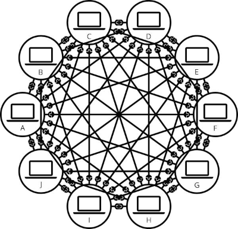
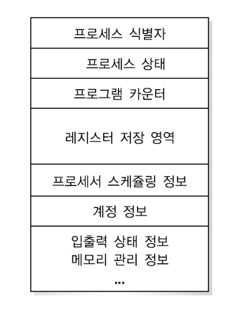
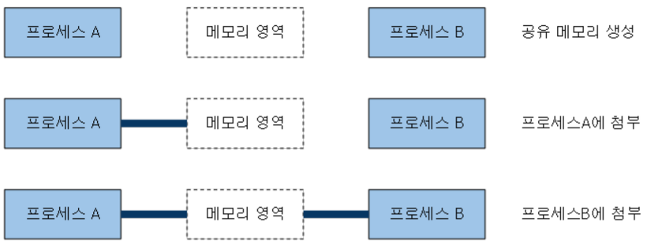

# 2주차 커리큘럼

## 개념

---

### 테스트

- **단위테스트**
    
    > **하나의 모듈을 기준으로** **독립적으로** 진행되는 가장 작은 단위의 테스트
    > 
    
    <aside>
    ❗ 애플리케이션을 구성하는 **하나의 기능이 올바르게 작동하는지를** **독립적으로** 하는 테스트
    
    </aside>
    
    - **단위테스트의 필요성**
        1. 테스팅에 대한 **시간과 비용을 절감**할 수 있다.
        2. 새로운 기능 추가시에 수시로 **빠르게** 테스트할 수 있다.
        3. 리팩토링시에 **안정성**을 확보할 수 있다.
        
        > **리팩토링** : 결과의 변경없이 코드의 구조를 재조정하는것
        > 
    - **FIRST규칙**
        
         **Fast** : 테스트는 **빠르게** 동작하여 자주 돌릴 수 있어야 한다.
        
        **Independent** : 각각의 테스트는 **독립적이며** 서로 의존해서는 안된다.
        
        **Repeatable** : 어느 환경에서도 **반복가능**해야한다.
        
        **Self-validating** : 테스트는 성공 또는 실패로 bool값으로 결과를 내어 **자체적으로** **검증되어야 한다.**
        
        **Timely** : 테스트는 실제 코드를 구현하기 **직전에 구현해야한다.**
        
    - **단위테스트 패턴**
        
        **Given(준비)** - 어떠한 데이터가 준비되었을 때
        
        **When(실행)** - 어떠한 함수를 실행하면
        
        **then(검증)** - 어떠한 결과가 나와야한다.
        
- **통합테스트**
    
    **모듈을 통합하는 과정**에서 **모듈 간의 호환성**을 확인하기 위해 수행되는 테스트이다.
    
    <aside>
    ❗ 단위테스트가 끝난 모듈들이 올바르게 **연계되어 동작하는지** 검증하는 테스트
    
    </aside>
    
    - **통합테스트의 유형**
        - **하향식** - **상부의 모듈**부터 통합하며 테스트를 순차적으로 진행하는 방식이다. **설계상의 결함을 빨리 발견할 수 있다.**
        - **상향식** - **최하위 모듈**을 통합 후, 상부의 모듈을 순차적으로 추가 테스트하는 방식이다. **하위 모듈을 충분히 테스트해볼 수 있다.**
        - **샌드위치 테스트** - **상향식과 하향식의** **장점**을 이용하는 방식이다. **병렬테스트**가 가능하고 **시간을 절약**할 수 있다.
        - **빅뱅 테스트** - 시스템을 구성하는 모듈을 각각 **따로 구현**하고 전체시스템을 한번에 시험하는 방식이다.
- **기능테스트**
    - **기능테스트**
        - **새 기능이 추가**되거나 **기존 기능의 수정**이 완료될 때 수행된다.
    
    <aside>
    ❗ **모든 코드가 함께 실행되는 상태**에서 전체 애플리케이션의 기능을 확인하는 테스트
    
    </aside>
    
    - **비기능테스트**
        - **품질에 대한 측면**을 기반으로 테스트하는 것이다.
    - **기능 VS 비기능**
    
    | 기능 | 비기능 |
    | --- | --- |
    | 소프트웨어가 모든 요구 사항을 준수하는지 테스트 | 시스템의 특정 동작보다는 시스템이 작동하는 방식을 검사하는 방식 |
    | 제품의 기능과 결과가 중점 | 제품의 작동 방식(성능,유용성,안정성 등)이 중점 |
    
    > 비기능테스트전에 기능테스트를 먼저한다.
    > 
- **테스트 예시**
    - **대입 예시** - 기능성 휴대폰에 필요한 주요부품은 배터리와 심카드라고 전제한다.
        - **단위테스트** - 배터리의 수명, 용량 및 기타 변수를 확인하고 심 카드가 활성화되는지 확인한다.
        - **통합테스트** - 배터리와 심카드가 일체화되어 **휴대폰을 이 잘 작동하는지** 확인한다.
        - **기능테스트** - **휴대폰 조립 후에** 휴대폰의 기능 및 배터리 사용량은 물론 심 카드 설비  등을 확인한다.
    - **코드 예시** - 회원가입과 로그인을 목적으로 하는 프로그램
        
        ```java
        static class data{
        		String db_name;
        		String db_password;
        		public data() {
        			
        		}
        		public void sign(String name,String password) {
        			db_name = name;
        			db_password = password;
        		}//문자열이 제대로 들어가는지 단위 테스트
        		public boolean login(String name,String password) {
        			if((db_name.equals(name)) && (db_password.equals(password))) {
        				return true;
        			}
        			return false;
        		}
        	}//문자열 비교가 제대로 되는지 단위 테스트
        public static void main(String[] args) {
        		Scanner scan = new Scanner(System.in);
        		data d = new data();
        		while(true) {
        			System.out.print("1.회원가입 2.로그인 : ");
        			int n=scan.nextInt();
        			if(n == 1) {
        				String name = scan.next();
        				String password = scan.next();
        				d.sign(name,password);
        				System.out.println("회원가입 되었습니다.");
        			}
        			else if(n==2) {
        				String name = scan.next();
        				String password = scan.next();
        				if(d.login(name, password)==true) {
        					System.out.println("로그인되었습니다.");
        					break;
        				}
        				else {
        					System.out.println("아이디가 없거나 비밀번호가 틀렸습니다.");
        					break;
        				}
        			}   //문자열이 저장되고 로그인메소드가 제대로 확인하는지 통합테스트
        		}
        	}
        
        }
        ```
        
- **테스팅 라이브러리**
    
    <aside>
    💡 UI컴포넌트를 사용자 친화적으로 **테스트할 수 있게 도와주는 패키지 묶음**이다
    
    </aside>
    
    - **Jest**
        - 페이스북에서 만든 **테스트 프레임워크**
        - **자체적인 test runner**와 **test util** 제공
        - **Jest 테스트 실행 예시**
            1. nodejs설치후 터미널에 입력
                
                `npm init -y`
                
                `npm install -save-dev jest`
                
            2. pack.json 파일에서 scripts프로퍼티에 명령어 추가
            
            ```json
            
            {
            	...
            	"scripts": {
            		"jest": "jest"
            	}
            	...
            }
            ```
            
            1.  test/sample.spec.js파일을 만든다.
            
            ```json
            test('This is a sample', () => {
            	expect(true).toBe(true);
            ));
            ```
            
            1. 파일 생성후 테미널에서 명령어를 실행한다.
                
                `npm run jest`
                
            2. 테스트 결과
                
                
                
    - **리액트 테스팅 라이브러리**
        - 구현 기반의 테스트 도구인 Enzyme의 대안으로 자리 잡은 **테스트 도구**이다. 세부적인 구현사항보다는 실**제 사용자 경험과 유사한 방식의 테스트**를 작성하는 것이 좋다.
        - **Jest+React 컴포넌트 test util** 제공
        - **리액트 테스팅 가이드 원칙**
            1. 어떤 유틸리티가 렌더링 컴포넌트와 관련이 있다면, 이는 컴포넌트 인스턴스가 아닌 DOM노드를 직접 다루어야 한다.
            2. 사용자가 실제로 사용하는 방법으로 어플리케이션 컴포넌트를 테스트하는데 유용해야한다.
            3. 유틸리티 구현과 API는 간결하고 유연해야한다.
    - **쿼리**
        
        <aside>
        💡 테스팅 라이브러리가 페이지에서 **요소를 찾기위해 제공하는 메서드**이다.
        
        </aside>
        
        - **모두에게 접근 가능한 쿼리** : 보조적인 기술을 사용하거나 **시각적/마우스 사용을 하는 사용자들의 경험**을 반영하는 쿼리이다.
        - **의미론적 쿼리** : HTML5와 ARIA에 순응적인 선택자이다. 이러한 속성과 상호작용하는 사용자 경험은 브라우저와 보조적 기술이 많이 다를 수 있다.

### 인터넷

<aside>
💡 수많은 **클라이언트 컴퓨터**와 **서버컴퓨터**들로 구성된 전세계를 하나로 연결하는 **네트워크들의 집합체**이다.

</aside>

- **인터넷 동작원리**
    
    
    - **네트워크** : 그물처럼 **통신망으로 서로 연결된 체계**를 말한다. 컴퓨터가 많아질 수록 **물리적인 연결이 많이 필요해진다.**
    
    
    
    - **라우터** : 컴퓨터끼리 서로 연결할 때 주어진 컴퓨터에서 **보낸 메세지가 올바른 대상 컴퓨터에 도착하는지 확인**하는 일만 하는 **소형 컴퓨터**이다. 단일 플러그를 줄이고 케이블이 필요없다.
    
    
    
    - **모뎀** : 네트워크를 전화 시설과 연결하기 위한 특수 장비, 모뎀을 통해 **네트워크 정보를 전화시설에서 처리할 수 있는 정보로 바꾸고** 그 반대도 마찬가지이다.
    
    > 모뎀을 통해 네트워크를 **인터넷 서비스 제공업체에 연결하여** 액세스하여 만들어진 **네트워크 인프라가** **지금의 인터넷**이다.
    > 
    
    
    
- **브라우저 동작원리**
    
    
    
    1. HTML 마크업을 처리하여 DOM트리를 생성한다.
    2. CSS마크업을 처리하여 CSSOM트리를 생성한다.
    3. DOM트리와 CSSOM트리를 결합하여 렌더링 트리를 생성한다.
    4. **렌더링 트리 배치** : 각 노드에 대해 화면에서의 정확한 위치와 크기를 계산한다.
    5. **렌더 트리 그리기** : UI 백엔드에서 렌더링 트리의 각 노드를 가로지르며 렌더링한다.
    
    <aside>
    ❓ **‘렌더’**는 HTML로 입력받아 해석해서 **표준 출력 장치**로 출력 해 주는 것이고, **‘렌더링 엔진’**은 요청받은 내용을 브라우저 **화면**에 표시하는 것이다.
    
    </aside>
    
- **DNS와 동작원리**
    
    <aside>
    💡 도메인 이름을 호스트의 **네트워크 주소로 바꾸거나** 그 **반대의 변환**을 수행할 수 있도록 하기 위해 개발된 시스템이다.
    
    </aside>
    
    - **동작원리**
        
        
        
        1. 사용자가 컴퓨터에 네이버의 주소를 입력한다.
        2. PC가 미리 설정되어 있는 **DNS에게** 네이버(www.naver.com)라는 **hostname에 대한 IP주소를 물어본다**. Local DNS에 네이버의 IP 주소가 없을 경우 2-1로 넘어간다.
        
         2-1. **Local DNS**는 네이버의 IP주소를 찾기 위해 **다른 DNS서버들과 통신**한다. Root DNS서버에 네이버의 IP주소를 요청한다. 이를 위해서는 Local DNS 서버에는 **Root DNS서버의 정보가 미리 설정되어 있어야한다.**
        
        <aside>
        ❓ **RootDNS**는 트리 구조인 DNS의 계층에서 **최상위에 위치하는 서버**이다.
        
        </aside>
        
        1. Root DNS에서 모른다면 LocalDNS에게 **다른 DNS서버로 가라고 한다.**
        2. Local DNS는 com을 관리하는 서버로 가서 **네이버의  IP주소를 요청**한다.
        3. com을 관리하는 서버에서도 모른다면 naver.com도메인을 관리하는 **DNS서버로 가라고 한다.**
        4. naver.com을 관리하는 **DNS서버**에게 네이버의 **IP주소를 요청**한다.
        5. naver.com을 관리하는 DNS서버에서 **IP를 알려준다**.
        6. IP를 수신 받은 Local DNS는 네이버에 대한 IP주소를 캐싱(이후 똑같은 정보를 물어보면 빠르게 응답해주기 위해)하고 그 IP주소 정보를 **단말기에 전달**해준다.
- **도메인네임**
    
    <aside>
    💡 네트워크상에서 컴퓨터를 식별하는 **호스트명**을 가리키며, **도메인 레지스트리에서** **등록된 이름**을 의미한다.
    
    </aside>
    
    - **도메인 이름 생성 규칙**
        1. Label과’,’으로 생성한다.
        2. Label에 쓸수 있는 글자는 알파벳,숫자,’-’,한글이 있다.
        3. Label은 ‘-’으로 시작하거나 끝날 수 없다.
        4. 알파벳의 대소문자 구별은 없다.
        5. Label의 길이는 2~63자 이내로 써야한다.
        6. 한글이 포함된 Label은 17자 이하로 써야한다.
        
        > **한국도메인 양식** - [https://krnic.or.kr/jsp/resources/domainInfo/krDomainInfo.jsp](https://krnic.or.kr/jsp/resources/domainInfo/krDomainInfo.jsp)
        > 
- **호스팅**
    
    <aside>
    💡 **대형 서버의 기능**을 빌려쓰는 것
    
    </aside>
    
    - **호스팅의 종류**
        1. **웹 호스팅** : 하나의 서버장비를 **여러명이 공유**하여 사용하는 것이다. **트래픽 양이 적은** 기업이나 개인 홈페이지에 쓰기에 유용하다.
        2. **서버 호스팅** : **한명의 고객**이 하나의 서버장비를 임대하는 호스팅이다. **트래픽 양이 많은** 대형 홈페이지를 구축할 때 사용하는 서비스이다.
        3. **클라우드 호스팅** : 서버호스팅과 비슷하지만 **가상 서버**를 임대한다. 자유롭게 서버스펙을 조절할 수 있다. **트래픽 변동량이 많을 때** 적절하다.

### 프론트엔드

<aside>
💡 **사용자가 볼 수 있는 화면(UI)**를 의미한다. 사람들이 웹 애플리케이션을 쉽게 사용할 수 있도록 하는 것이 중요하다

</aside>

- **HTML(Hyper Text Markup Language)**
    
    <aside>
    💡 웹 페이지에서 다른 페이지로 이동할 수 있도록 하는 기능을 가진 **문서를 만드는 언어**이다.
    
    </aside>
    
    - **HTML 영역**
    
    
    
    
    
    | 머리부 | 몸체부 |
    | --- | --- |
    | <head>태그 영역 | <body>태그 영역 |
    | 문서의 형태, 타이틀 정보, 스타일 정보 ,자바스크립트에 대한 정보가 들어가는 부분 | 정보전달을 위한 데이터가 들어가는 부분 |
    | 웹 브라우저가 알아야 할 중요한 정보들이 들어가는 곳 | 화면에 직접 출력되는 부분 |
    - **HTML의 구성요소**
        - **요소** - HTML에서 시작태그와 종료태그로 이루어진 **모든 명령어들, 태그명령어 종류들**을 말한다.
        - **태그** - 요소의 하나로서 **시작태그**와 **종료태그**로 이루어져있다
        - **속성** - 조금 더 **구체화된 명령어,** 요소의 시작태그안에 사용된다. 다양한 효과를 부여할 수 있다.
        - **값** - **속성과 관련된 값**을 의미한다.
    - **HTML태그 종류**
        - [https://itworldyo.tistory.com/96](https://itworldyo.tistory.com/96)
        
- **CSS(Cascading Style Sheets)**
    
    <aside>
    💡 HTML,XHTML,XML 같은 문서의 **스타일을 꾸밀 때** 사용하는 **스타일 시트 언**어이다.
    
    </aside>
    
    - **CSS의 특징**
        - 글꼴, 배경색, 너비와 높이, 위치 등을 저장하거나, 웹 브라우저와 스크린 크기, 장치에 따라서 **화면을 다르게 표시될 수 있도록 지정**할 수 있다.
        - **기능 확장성** - HTML 대부분의 요소들에 **다양한 기능을 추가**할 수 있다.
        - **양식의 모듈화** - 일정 양식을 CSS로 작성한 후 HTML에 적용하면 전체 문서가 같은 양식으로 통일감있게 구성될 수 있다.  스타일에 변경사항이 생겨도 CSS파일만 수정하면 되므로 **유지보수에 편리**하다.
    - **CSS의 Ruleset**
        
        <aside>
        💡 Selector에 의해 특정 HTML 요소를 어떻게 렌더링할 것인지 **브라우저에 지시하는 역할을  한다.**
        
        </aside>
        
        - **Ruleset의 구성요소**
            
            
            
            - **선택자(Selector)** : HTML요소의 **style를 정의하는데 사용**한다. 스타일을 적용하고자 하는 HTML요소를 선택하기 위해 CSS에서 제공하는 수단이다.
            - **선언(Declaration)** : 해당 element의 Properties를 style하고 싶은대로 **구체화한다.**
            - **속성(Property)** : selector로 HTML요소를 선택하고 속성과 값을 지정하는 것으로 **다양한 style을 정의**할 수 있다. 표준스펙으로 이미 지정되어 있는 것을 사용하여야 한다. 여러 개의 속성을 연속해서 지정할 수 있으며 **‘,’로 구분**한다.
            
            ```css
            p
            {
            		color : ...;
            		font-size : ...;
            }
            ```
            
            - **값(Value)** : 해당 속성에 사용할 수 있는 **값을 특정 단위로** 지정한다.
            
            ```css
            p
            {
            		color : orange;
            		font-size : 16px;
            }
            ```
            
    - **CSS 적용법**
        1. **내부스타일**
            1. <head>태그내에 <style>태그를 사용하여 작성한다.
            
            ```css
            	<head>
            	...
            	    <style>
            	      h1 {
            	        color: red;
            	      }
            	    </style>
            </head>
            ```
            
        2. **인라인 스타일**
            1. 전체가 아닌 하나의 요소에만 특정 스타일을 지정할 때 사용한다.
            2. 여러 스타일을 나열할 때 반드시 ‘,’를 입력해야한다.
            
            ```css
            <body>
                  <h1 style="color: red;">Welcome!</h1>
            </body>
            ```
            
        3. **외부스타일**
            1. HTML파일과 CSS파일을 따로 만들어 <link>태그로 연결시켜준다
            
            ```css
            	<head>
            	...
            	    <link rel="stylesheet" href="basic.css" />
            	</head>
            ```
            
            <aside>
            ❓ **rel**    : **현재 문서와 외부 파일이** **어떤 관계**에 있는지 입력한다.
            **herf** : **파일의 경로**를 입력한다.
            
            </aside>
            
- **JS(Java Script)**
    
    <aside>
    💡 웹 브라우저라고 분류되는 **소프트웨어들을** 프로그래밍적으로 **제어하기 위한 언어이다.**
    
    </aside>
    
    - **JS 특징**
        1. **인터프리터 언어** - 최근 웹 브라우저 대부분에는 실행시간에 자바 스크립트 코드를 컴파일 하는 JIT 컴파일러가 내장되어 있어 **실행속도가 빨라졌다.**
        2. **동적 프로토타입 기반 객체 지향 언어** - 클래스가 아닌 프로토타입을 상속하는 프로토타입 기반 객체 지향 언어이다. 객체를 생성한 후에도 프로퍼티와 메서드를 **동적으로 추가하거나 삭제**할 수도 있다.
        3. **동적 타입 언어** - 변수타입이 없어서 프로그램을 실행하는 도중에 변수에 저장되는 **데이터 타입이 동적으로 바뀔 수 있다.**
        4. **입급 객체 함수** - 함수는 객체이며, 함수에 함수를 인수로 넘길 수 있다.
        
        <aside>
        ❓ **인터프리터 언어** : 컴파일 작업을 거치지 않고, **소스코드를 바로 실행할 수 있는 언어**이다.
        
        </aside>
        
    - **JS vs JAVA**
        
        
        | 자바스크립트 | 자바 |
        | --- | --- |
        | 인터프리터 언어 | 컴파일 언어 |
        | 타입명시 X | 타입명시 엄격 |
        | 클래스기반 객체지향언어 | 프로토타입기반 객체지향언어 |
    
- **웹보안지식**
    - **HTTPS(Hypertext Transfer Protocol Secure)**
        - **SSL(보안소켓계층)**을 사용하여 서버와 브라우저 사이에 안전하게 **암호화된 연결을 만들 수 있게 도와주고**, 서버 브라우저가 민감한 정보를 주고받을 때 도난 당하는 것을 막아준다.
        - **SSL인증서**는 사용자가 사이트에 제공하는 **정보를 암호화하여** 중간에 누군가 정보를 훔쳐도 데이터가 암호화되어있어 해독할 수 없다.
        
        <aside>
        ⚠️ **HTTP**는 **HTTPS와 다르게** **SSL**을 사용하지 않아 **보안에 취약하다**는 점에서 차이가 있다.
        
        </aside>
        
        - **HTTPS의 암호화 방식**
            - **대칭키 암호화** - 클라이언트와 서버가 **동일한 키**를 사용해 암호화,복호화를 진행한다. **키가 노출되면 위험하지만 연산 속도가 빠르다.**
            - **비대칭키 암호화** - **1개의 쌍으로 구성된** 공개키와 개인키를 암호화 복호화 하는데 사용한다. **키가 노출퇴어도 안전하지만 연산속도는 느리다.**
                - **공개키 암호화** : 공개키로 암호화를 하면 **개인키로만 복호화**할 수 있다. 개인키는 자신만 가지고 있으므로, **자신만 볼 수 있다.**
                - **개인키 암호화** : 개인키로 암호화하면 **공개키로만 복호화**할 수 있다. 공개키는 모두에게 공개되어있어서 내가 인증한 정보임을 알려 **신뢰성을 보장할 수 있다.**
        - **HTTPS흐름**
        
        1. 클라이언트가 서버로 최초 연결을 시도한다.
        
        1. 서버는 공개키를 브라우저에게 넘긴다.
        
        1. 브라우저는 인증서의 유효성을 검사하고 세션키를 발급한다.
        
        1. 브라우저는 세션키를 보관하며 추가로 서버의 공개키로 세션키를 암호화하여 서버로 전송한다.
        
        1. 서버는 개인키로 암호화된 세션키를 복호화하여 세션키를 얻는다.
        
        1. 클라이언트와 서버는 동일한 세션키를 공유하므로 데이터를 전달할 때 세션키로 암호화,복호화를 진행한다.
        
        
        
    - **컨텐츠보안정책(Content-Security Policy)**
        
        <aside>
        💡 교차사이트 스크립팅(XSS) 공격과 데이터 삽입 공격을 막기 위한 **추가적인 브라우저 보안 계층**이다.
        
        </aside>
        
        - **CSP를 받은브라우저의 동작**
            - 유효한 도메인으로 지정한 도메인의 스크립트만 실행하여 **XSS위험성을 제거**한다.
            - 허용 목록에 있는 도메인에서 **수신한 스크립트만 실행**하며 **그 외 스크립트는 무시한다.**
        - **CSP 사용예시**
            1. 모든 컨텐츠는 현재 도메인에서만 제공되어야한다.
            
            ```css
            Content-Security-Policy: default-scr ‘self’
            ```
            
            1. 신뢰할 수 있는 특정 도메인과 그것의 모든 하위 도메인의 컨텐츠를 허용한다.
            
            ```css
            Content-Security-Policy: default-scr ‘self’ *.trusted.com
            ```
            
            1. 이미지는 모든 도메인, 미디어와 스크립트는 특정 도메인에만 허용한다.
            
            ```css
            Content-Security-Policy: default-scr ‘self’; img-src *;
                                     media-src media.com media2.com; script-src (주소)
            ```
            
            1. 컨텐츠 다운로드는 기본적으로 HTTPS를 사용하는 특정 도메인에만 사용한다.
            
            ```css
            Content-Security-Policy: default-scr HTTPS://(주소)
            ```
            
    - **CORS(Cross-Origin Resource Sharing)**
        
        <aside>
        💡 브라우저에서는 보안적인 이유로 cross-origin http요청들을 제한한다. 그래서 cross-origin요청을 하려면 서버의 동의가 필요하다. **서버가 동의에 따라 요청을 허락,거절하는 메커니즘을 CORS**라고 한다.
        
        </aside>
        
        > **corss-origin** : 프로토콜, 도메인 ,포트번호 중 한가지라도 일치하지 않는 경우
        > 
        - **CORS 동작원리**
            - **단순요청** - 서버에게 바로 요청을 보내는 방법
            - **예비요청** - 서버에 예비 요청을 보내서 안전한지 판단한 후에 본 요청을 보내는 방법
- **패키지매니저**
    
    <aside>
    💡 **패키지를 다루는 작업**을 안전하게 수행하기 위해 사용되는 **툴**이다.
    
    </aside>
    
    > **패키지**(코드의 배포)는 **라이브러리**(코드의 작성)와 유사한 개념이다.
    > 
    - **npm(Node Packaged Manager)**
        
        <aside>
        💡 명령어로 자바스크립트 라이브러리를 설치하고 관리하는 패키지매니저이다.
        
        </aside>
        
        - **npm을 사용하는 이유**
            - 라이브러리를 HTML중간에 삽입하면(CDN방식) 직접찾아야하지만 npm을 사용하면 **한곳에서 관리하여 찾기 쉬워진다**.
            - CDN방식은 직접 태그를 모두 찾아서 들고와야 하기 떄문에 일이 많아지지만, **npm을 사용하여 명령어 한줄로 일을 줄일 수 있다.**
        
    - **yarn**
        
        <aside>
        💡 **의존성관리 자바스크립트** **패키지 매니저**이다.
        
        </aside>
        
    
- **formatters**
    
    <aside>
    💡 **정한 코딩 컨벤션(코드 작성 스타일 규칙)에 따라** 코드 스타일을 알아서 정리해주는 도구이다.
    
    </aside>
    
    - **prettier**
        - visual studio code extention으로 정해진 규칙에 따라 자동으로 **코드 스타일을 정리해주는 도구**이다.
        - **코드가 이쁘게 보이도록 하는 것에 중점**을 둔다.
    - **ESLint**
        - 자바스크립트 문법에서 **에러를 표시해주는 도구**이다.
        - 코드에러를 잡아내고 문제를 강제하는 등 코드 **품질 개선에 중점**을 둔다.

### 백엔드

<aside>
💡 웹 애플리케이션의 사용자가 보지 못하는 영역인 **서버나 데이터베이스를 관리하는 기술**이다. 사용자들이 원하는 정보를 제공할 수 있도록 **데이터를 관리하거나 서버를 운영**한다.

</aside>

- **OS(Operating System)**
    
    <aside>
    💡 시스템 자원을 관리하여 **사용자가 하드웨어의 기능을 이용하고** **응용프로그램을 실행할 수 있도록** **도와주는 소프트웨어**
    
    </aside>
    
    - **운영체제의 기능**
        - **자원관리**
            1.  **메모리 관리** : 메인 메모리와 보조메모리에 **동일하게 공간을** **할당하고 삭제하는 기능을한다.**
            2.  **프로세스 관리** : 실행중인 프로그램의 프로세스의 **생성부터 실행, 종료**까지의 **전 과정에 관여**한다.
            3. **입출력 장치 관리** : 특수 장치 드라이버를 제공하여 **특정 하드웨어와 서로 통신**할 수 있는 **인터페이스를 제공**한다.
            4. **파일 관리** : 탐색기 내에서 파일을 검색하고 생성과 삭제하는 기능을 한다.
        - **시스템 관리**
            1. **시스템 보호** : 자원을 보호하기 위해 권한을 부여하기도 하고 암호화 하기도 한다. **프로세스가 서로 data에 접근하지 못하도록 보호**하기도한다.
            2. **네트워크** : 프로세서가 **통신할 때 경로 설정, 접속 정책, 충돌, 보안 등을 고려하는데** 이를 운영 체제가 관리한다.
            3. **명령 해석기** : **사용자나 응용 프로그램**으로부터 **대화형의 명령어가 들어오면 이를 운영체제에 전달하는 인터페이스** 이다.
    - **OS의 작동 방식**
        - **멀티프로그래밍** : CPU에는 하나의 프로그램 밖에 올라가지 못하는데 해결중이던 프로세스가 대기상태가 되는 동안 CPU가 놀게된다. 메모리에 **여러 프로세스들을 올려주고 대기상태가 되면 다음 JOB로 넘어가 최대한 CPU의 대기상태를 제거하는 방식이다.**
        - **타임 셰어링** : 멀티테스킹을 위해 메모리에 여러 JOB를 올려 놓으면 메모리가 모자라는 경우가 생길 수 있는데, **스와핑을 통해 프로세스를 가상 메모리에 저장**한다.
        - **인터럽트** : CPU가 job를 처리하고 있을 때 I/O디바이스 등의 장치나 예외상황이 발생하여 처리가 필요할 경우 신호를 주어 처리할 수 있도록 하는 것을 말한다.
        - **컴퓨터 전원을 켤 때 예시**
            1. 우리가 컴퓨터의 전원을 누르는 순간 컴퓨터에 전원을 공급하는 파워 서플라이는 메인보드에 부착된 장치들(CPU, 디스크, 메모리(RAM, ROM) 등)에게 전력을 공급합니다.
            2. CPU가 ROM에 저장된 펌웨어인 BIOS를 실행합니다.
            3. 실행된 BIOS는 컴퓨터를 켤 때 문제가 있나 확인하는 프로그램인 POST를 실행해 주변 하드웨어 체크를 합니다.
            4. POST 과정이 끝난 BIOS는 부팅매체를 선택하고 부팅매체의 MBR에 저장된 부팅정보를 읽어오는 *부트스트랩을 실행합니다.
            5. 부트스트랩 과정으로 RAM에 부트로더가 올라가고, 부트로더는 디스크에 있는 **OS 코드를 복사**
            해 RAM에 붙여서 OS를 실행합니다.
            6. 제어권이 OS에 넘어오며 성공적으로 OS가 부팅됩니다
            7. OS는 대기하고 있던 첫번째 프로세스를 실행합니다.
            8. 인터럽트가 발생하면서 CPU는 각종 작업을 처리합니다.
                
                
                
    - **프로세스 관리**
        
        <aside>
        💡 **프로세스** : 컴퓨터에서 연속적으로 실행되고 있는 컴퓨터 프로그램 즉, **동적인 개념으로는 실행된 프로그램**을 의미한다.
        
        </aside>
        
        > **프로세스 관리** : 프로세스를 **보호**해주고 프로세스마다 **작업 시간을 할당**해주고 그 작업에 **우선순위를 매기는 등**의 작업이다.
        > 
        - **프로세스 상태**
            - **New(생성)** : 프로세스 생성상태
            - **Running(실행)** : 프로세스가 CPU에 할당되어 실행중인 상태
            - **Ready(준비)** : 프로세스가 CPU에 할당되기를 기다리는 상태
            - **Waiting(대기)** : Block(보류)라고도 하며, 프로세스가 입출력이나 이벤트를 기다리는 상태
            - **Terminated(종료)** : 프로세스 종료 상태
            - **승인(Admitted)** : 프로세스 생성이 가능하여 승인된다.
            - **스케줄러 디스패치(Scheduler Dispatch)** : 준비상태에 있는 프로세스 중 하나를 선택하여 실행시키는 것이다.
            - **입출력 또는 이벤트대기(I/O or Event wait)** : 실행중인 프로세스가 입출력이나 이벤트를 처리해야하는 경우, 입출력/이벤트가 모두 끝날 때까지 대기 상태로 만드는 것
            - **입출력 또는 이벤트 완료(I/O or Event Completion)** : 입출력/이벤트가 끝난 프로세스를 준비 상태로 전환하여 스케줄러에 의해 선택될 수 있도록 만드는 것
                
                
                
            - **프로세스 제어블록 (Process Control Block)**
                - 프로세스에 대한 **모든 정보를 저장하는 데이터 구조**이다.
                - 프로세스를 생성할 때 만들어지고, 메인 메모리에 유지되며, 운영체제에서 한 프로세스의 존재를 정의한다. 프로세스의 **실행이 종료되면 프로세스 제어 블록도 삭제**된다.
                - **PCB 구성**
                    
                    
                    - **프로세스 식별자** – 각 프로세스에 대한 고유 식별자를 지정한다.
                    - **프로세스 상태** – 프로세스의 상태를 표시한다.
                    - **프로그램 카운터** – 프로세스 실행을 위한 다음 명령의 주소를 표시한다.
                    - **레지스터 저장 영역** – 누산기, 인덱스 레지스터, 범용 레지스터, 조건 코드 등에 관한 정보로 컴퓨터 구조에 따라 수나 형태가 달라진다. 인터럽트가 발생하면 프로그램 카운터와 함께 저장되어 다시 실행될 때 원상 복귀할 수 있게 한다.
                    - **프로세서 스케줄링 정보** – 프로세스의 우선순위, 스케줄링 큐에 대한 포인터, 그외 다른 스케줄 매개변수를 가진다.
                    - **계정 정보** – 프로세서 사용 시간, 실제 사용 시간, 사용 상한 시간, 계정 번호, 작업이나 프로세스 번호 등이다.
                    - **입출력 상태 정보** – 특별한 입출력 요구 프로세스에 할당된 입출력장치, 개방된 파일의 목록 등이다.
                    - **메모리 관리 정보** – 메모리 영역을 정의하는 하한 및 상한 레지스터 또는 페이지 테이블 정보이다.
                    
                    
                    
    - **스레드와 동시성**
        - **스레드** : 프로세스가 **할당받은 자원을 이용하는 실행 흐름의 단위**
        - **멀티 스레드** : 하나의 프로세스에서 **여러 개의 스레드가 병행적으로 처리**되는 것이다.
            
            
            
        - **동시성과 병렬성의 차이**
        
        | 동시성 | 병렬성 |
        | --- | --- |
        | 동시에 실행되는 것 같이 보이는 것 | 실제로 동시에 여러 작업이 처리되는 것 |
        | 싱글 코어에서 멀티 스레드를 동작시키는 방식 | 멀티 코어에서 멀티 스레드를 동작시키는 방식 |
        | 멀티태스킹을 위해 여러 개의 스레드가 번갈아가며 실행되는 성질 | 한 개 이상의 스레드를 포함하는 각 코어들이 동시에 실행되는 성질 |
        | 한번에 많은 것을 처리 | 한번에 많은 일을 처리 |
        | 논리적인 개념 | 물리적인 개념 |
        | 싱싱글 코어에서 멀티 스레드를 이용해 동시성을 구현하는 일부 케이스에 대한 내용, 멀티 코어에서 멀티 스레드를 이용해 멀티 스레드를 이용하여 동시성을 만족할 경우 실제 물리적 시간으로 동시에 실행된다. | 물리적인 시간에 동시에 수행되는 것이다. 멀티코어에 포커스가 맞춰지면 안된다. |
        
        
        
        - **데드락**
            
            <aside>
            💡 **시스템 자원에 대한 요구가 뒤엉킨 상태**이다. 즉 둘 이상의 프로세스가 다른 프로세스가 점유하고 있는 자원을 서로 기다릴 때 무한 대기에 빠지는 상황을 말한다.
            
            </aside>
            
            - **데드락 발생 예시**
                
                
                
            - 데츠락 발생 조건과 예방법
                - **상호 배제** : 한번에 **프로세스 하나만 해당 자원을 사용**할 수 있다. 사용중인 자원을 다른 프로세스가 사용하려면 요청한 자원이 해제될 때까지 기다려야 한다.
                - **예방** : 한 번에 **여러 프로세스가 공유 자원을 사용**할 수 있게 한다.
                - **점유 대기** : 자원을 최소한 하나 보유하고, 다른 프로세스에 할당된 자원을 점유하기 위해 대기하는 프로세스가 존재해야 한다.
                - **예방** : 프로세스 실행에 필요한 모든 자원을 한꺼번에 요구하고 허용할 때까지 작업을 보류해서, 나중에 또다른 자원을 점유하기 위한 대기조건을 성립하지 않도록 한다.
                - **비선점** : 이미 할당된 자원을 강제로 빼앗을 수 없다.
                - **예방** : 이미 다른 프로세스에게 할당된 자원이 선점권이 없다고 가정할 때, 높은 우선순위의 프로세스가 해당 자원을 선점할 수 있도록 한다.
                - **순환 대기** : 대기 프로세스의 집합이 순환 형태로 자원을 대기하고 있어야한다.
                - **예방** : 자원을 순환 형태로 대기하지 않도록 일정한 한 쪽 방향으로만 자원을 요구할 수 있도록 한다.
            - **데드락 해결법**
                - **회피법(Banker’s algorithm)**
                    - 프로세스가 자원을 요구할 때 시스템은 자원을 할당한 후에도 안정 상태로 남아있게 되는지를 사전에 검사하여 교착상태를 회피하는 기법이다.
                    - 안정상태에 있으면 자원을 할당하고, 그렇지 않으면 다른 프로세스들이 자원을 해지할 때까지 대기함
                - **교착상태 탐지 및 회복**
                    
                    <aside>
                    💡 교착 상태가 되도록 허용한 다음 회복시키는 방법이다.
                    
                    </aside>
                    
                    - **교착 상태 탐지** – 자원 할당 그래프를 통해 교착 상태를 탐지할 수 있다.
                        
                        
                        ‘Pi -> Rj’는 프로세스 Pi가 자원을 요청하고 기다리는 상태이다.
                        
                        ‘Rj -> pI’는 자원이 프로세스 Pi에 이미 할당된 것을 의미한다.
                        
                        자원을 요청할 때마다 탐지 알고리즘을 실행하면 그에 대한 오버헤드가 발생한다.
                        
                        
                        
                    - 교착 상태로부터 회복 – 교착 상태를 일으킨 프로세스를 종료하거나, 할당된 자원을 해제함으로써 회복하는 것을 의미한다.
                        1. 프로세스를 종료하는 방법
                            1. 교착 상태의 프로세스를 모두 중지한다.
                            2. 교착 상태가 제거될 때까지 한 프로세스씩 중지한다.
                        2. 자원을 선점하는 방법
                            1. 교착 상태의 프로세스가 점유하고 있는 자원을 선점하여 다른 프로세스에게 할당하며, 해당 프로세스를 일시정지시키는 방법이다.
                            2. 1.  우선 순위가 낮은 프로세스, 수행된 횟수가 적은 프로세스 등을 위주로 프로세스의 자원을 선점한다.
                        
    - **IPC(프로세스간 통신)**
        
        <aside>
        💡 IPC설비들 각각의 필요에 따라서 적당한 통신 설비들이 준비되어야 하는 것과 마찬가지로 내부 프로세스간 통신에도 그 상황에 맞는 IPC설비를 선택할 필요가 있게 된다.
        
        </aside>
        
        - PIPE
            - 통신을 위한 메모리공간(버퍼)을 생성하여 프로세스가 데이터를 주고받을 수 있게 해준다. 단방향의 통신이라는 단점이 존재한다.
            
            | 파이프 종류 | 익명 파이프 | 네임드파이프 |
            | --- | --- | --- |
            | 생성방법 | pipe함수 | mkfifo or mknod 함수 |
            | 외부 프로세스와의 통신 | X | O |
            | 통신 방식 | 단방향 방식 | 반이중 방식 |
            | 단점 | 외부프로세스와 통신 불가능 | 다수의 클라이언트를 처리하려면 여러 개의 파이프가 필요 |
        - Socket
            
            <aside>
            💡 프로세스가 드넓은 네트워크로 데이터를 내보내거나 받기위한 실제적인 창구 역할을 한다.
            
            </aside>
            
            - Socket 작동원리
                - 보내는 쪽이 소켓이라는 창구를 열고 소켓을 통해서 데이터를 보내면 네트워크 모델에 따라 목적지 호스트에 데이터가 도착하게 되고, 데이터를 담은 봉투에 써진 도착지의 포트 넘버와 같은 포트를 할당받은 프로세스를 찾아서 그 프로세스의 소켓을 통해 해당 프로세스에 데이터를 전달한다. 소켓을 열기 위해서는 호스트에 할당된 IP주소,포트넘버,프로토콜이 필요하다.
                
                
                
        - 공유메모리
        
        <aside>
        💡 프로세스 A가 메세지를 공유메모리에 전송하면 프로세스B가 공유메모리의 메세지를 읽는 방식으로 작동한다.
        
        - 대량의 정보를 다수의 프로세스에게 배포가능하다.
        - 빠르고 효율적이다.
        - 공유메모리 공간에 대한 접근제어가 필요하다
        </aside>
        
        
        
    - **poisx(Portable Operating System Interface)**
        - 서로 다른 UNIX OS의 공통 API를 정리하여, 이식성이 높은 유닉스 응용프로그램을 개발하기 위한 목적으로 만들어졌다. 즉, 유닉스의 API규격이다.
        - 리눅스는 유닉스와 별도로 개발되었지만 PISIX표준을 거의 다 준수해서 유닉스 호환 운영체제라고 할 수 있다.
        - 규격의 내용은 커널로의 C언어 인터페이스인 시스템 콜, 프로세스 환경, 파일과 디렉터리, 시스템 데이터베이스, tar 압축 포맷 등 다양한 분야를 이룬다.
        
- **JAVA**
    - **JAVA의 설명 및 특징**
        1. **자바는 객체지향 언어이다.** – 객체들을 먼저 만들고, 이것들을 하나씩 조립 및 연결하여 전체프로그램을 완성하는 기법을 쓰는 언어이다.
        2. **이식성이 높다** – JRE가 설치되어있는 모든 운영체제에서 실행이 가능하다.
        3. **인터프리터 언어이다.** – 텍스트 소스를 클래스파일로 만든 다음 자바런타임이 클래스 파일을 인터프리트 하면서 실행한다.
        4. **메모리를 자동으로 관리한다.** – 메모리를 자바가 직접 관리한다. 객체 생성시 자동으로 메모리 영역을 찾아서 할당하고 쓰레기 수집기(Garbage Collector)을 실행시켜 자동으로 사용하지 않는 객체를 제거한다.
        5. **멀티 스레드 구현이 쉽다.** – 스레드 생성 및 제어와 관련된 라이브러리 API를 제공하므로 운영체제에 상관없이 멀테스레드를 쉽게 구현할 수 있다.
        6. **동적 로딩을 지원한다.** – 실행시 모든 클래스가 로딩되는 것이 아니라 필요한 시점에 클래스를 로딩하여 사용할 수 있다.
        7. **분산환경을 지원한다.** TCP/IP 라이브러리가 기본적으로 포함되어 있고, http와 htp 프로토콜을 기본적으로 지원한다.
        8. **오픈소스 라이브러리가 풍부하다.** – 자바는 오픈소스 언어이고 라이브러리와 오픈소시가 방대하다. 따라서 유지보수를 쉽고 빠르게 진행할 수 있다.
    - **JAVA 컴파일 과정**
        1. 개발자가 자바 소스코드(.java)를 작성한다.
        2. 자바 컴파일러가 소스파일을 컴파인한다. 이때 나오는 파일은 자바 바이트코드(.class)파일로 아직 컴퓨터가 읽을 수 없고 자바 가상머신이 이해할 수 있는 코드이다.
        3. 컴파일된 바이트 코드를 JVM클래스로더에게 전달한다.
        4. 클래스로더는 동적로딩을 통해 필요한 클래스들을 로딩 및 링크하여 런타임 데이터 영역, 즉 JVM의 메모리에 올린다.
            - **클래스로더 세부동작**
                - **로드** : 클래스 파일을 가져와서 JVM의 메모리에 로드한다.
                - **검증** : 자바언어명세 및 JVM명세에 명시된 대로 구성되어있는지 검사한다.
                - **준비** : 클래스가 필요로 하는 메모리를 할당한다.
                - **분석** :클래스의 상수 풀 내 모든 심볼릭 레퍼런스를 다이렉트 레퍼런스로 변경한다.
                - **초기화** : 클래스 변수들을 적절한 값으로 초기화한다.
        5. 실행엔진은 JVM 메모리에 올라온 바이트 코드들을 명령어 단위로 하나씩 가져와서 실행한다.
            
            
            
            
            
            - **인터프리터** : 바이트 코드 명령어를 하나씩 읽어서 해석하고 실행한다. 하나하나의 실행은 빠르지만 전체적인 실행속도가 느리다.
            - **JIT 컴파일러** : 인터프리터의 단점을 보완하기 위해 도입된 방식으로 바이트 코드 전체를 컴파일 하여 바이너리 코드로 변경하고 이후에 해당 메서드를 더 이상 인터프리팅 하지 않고, 바이너리 코드로 직접 실행하는 방식이다. 바이트 코드 전체가 컴파일된 바이너리 코드를실행하는 것이기 때문에 전체적인 실행속도는 인터프리팅 방식보다 빠르다.
    - **JAVA Basic Sintax(기본 구문)**
        - **클래스** – 속성변수와 메소드와 생성자를 정의해놓은 일종의 틀
        - **상속** – 부모클래스가 소유한 멤버를 다른 자식클래스에게 그대로 물려주는 것
        - **클래스 형식**
            1. Packge 패키지명;
            2. import 수입클래스패키지명.수입클래스명;
            3. [public] - <클래스 수입 지정자>
            4. [abstract/final] - <클래스 성격 지정자>
            5. [abstract/final] - <클래스 성격 지정자>
            6. Class 클래스명
            7. 접근지정자 종류
                1. public : 모든곳에서
                2. protected : 타페키지에서도 자식클래스라면 호출가능
                3. default(생략가능) : 같은 패키지 내에서만
                4. private : 현재 클래스 내에서만
            8. [static] – static가 붙어있으면 클래스변수,공유변수라고 부른다. 객체 생성이없이도 호출이 가능해지고 static이 붙은 변수를 객체화한 다른 객체끼리 공유한다.
            9. Final – 종단변수라 불리고 처음 저장된 데이터는 초기화 후에 갱신이 불가능하다. 변수선언과 동시에 수동 초기화를 해주거나 생성자 안에서 수동 초기화를 해줘야한다.
            
- **DB**
    
    <aside>
    💡 여러 사람에 의해 공유되어 사용될 목적으로 통합하여 관리되는 데이터의 집합
    
    </aside>
    
    - **SQL**
        
        <aside>
        💡 데이터베이스에서 데이터를 정의하고 조작하기 위한 표준화된언어이다.
        
        </aside>
        
        - **SQL의 종류**
            - **DML(Data Manipulation Language)** – 테이블의 데이터를 조작하는 명령어
                - **INSERT** – 데이터베이스 객체에 데이터 삽입
                - **DELETE** – 데이터베이스 객체에 데이터 삭제
                - **UPDATE** – 데이터베이스 객체 안의 데이터 수정
                - **SELECT** – 데이터베이스 객체안의 데이터를 조회
            - **DDL(Data Definition Language)** – 데이터베이스, 테이블의 스키마를 정의,수정,삭제하는 명령어
                - **CREATE** – 데이터베이스 객체 생성
                - **DROP** - 데이터베이스 객체
                - **ALTER** – 기존에 존채하는 데이터베이스 객체를 다시 정의
            - **DCL(Data Control Language)** – 데이터베이스, 테이블의 접근권한이나 CRUD 권한을 정의하는 명령어
                - **GRANT** - 데이터베이스 객체에 권한 부여
                - **REVOKE** – 이미 부여된 데이터베이스 객체 권한 취소
    - **DBMS(DataBase Management System)**
        
        <aside>
        💡 데이터 베이스를 조작하는 소프트웨어를 뜻한다. 응용프로그램들이 DB를 공유하며 사용할 수 있는 기능을 제공한다.
        
        </aside>
        
        - **DBMS 기능**
            1. **정의** : 데이터에 대한 형식, 구조, 조건들을 저으이하는 기능이다.
            2. **저장** : 기억장치에 데이터를 저장하는 기능이다.
            3. **보안** : 하드웨어나 소프트웨어의 오류 또는 권한이 없는 접근으로부터 시스템을 보호한다.
            4. **공유** : 여러 사용자와 프로그램이 데이터베이스에 접근을 할 수 있도록 공유한다.
            5. **기능** : 데이터의 검색을 위한 질의나 데이터베이스의 갱신, 생성기능을 포함한다.
            6. **유지** : 요구사항의 변화에 따라 반영될 수 있도록 하는 기능이다.
    - **PostgreSQL**
        
        <aside>
        💡 개발자가 데이터의 무결성을 유지 관리하고, 모든 규모의 워크로드를 더 쉽게 관리하며, 필요에 따라 스케일링하는 데 도움을 주는 중요한 데이터베이스 솔루션입니다.
        
        </aside>
        
        - **Postgre 특징**
            - **관계형 모델 -** 관계형 DBMS가 가지고 있는 거의 모든 기능을 가지고 있다.
            - **고수준 확장성 -** 사용자 정의 오퍼레이터와 타입, 함수, 엑세스 메쏘드를 지원한다.
            - **객체지향 -** 상속, 객체와 같은 객체지향개념에서 볼 수 있는 여러 특징을 초보적이나마 구현하고 있다
        - **PostgreSQL 구조**
            - **Postmaster** -  최상위 데몬 프로세스이다. frontend와 backend 프로세스 사이의 통신을 담당하며, 공유버퍼 풀(공유메모리 내부에)을 할당하며. 시작 시에 다른 초기화 부분을 수행한다.
            - **postgres** - backend 데이터베이스 서버 프로세스이다. 항상 서버머신에서 수행된다.
            - **frontend** – 또 다른 머신상에서 돌아 갈수 있으며, postmaster를 거쳐서 postgres backend 에게 접속을 요청한다.
    - **noSQL**
        
        <aside>
        💡 많은 양의 데이터의 처리 속도를 향상시키기 위해 임시 저장공간에 데이터를 저장, 응답하는 방법과 단순 저장작업에 있어 매우 최적화된 키 값 저장 기법을 사용한다.
        
        </aside>
        
        - **NoSQL 특징**
            - 데이터간의 관계를 정의하지 않는다.
            - 스키마가 없다
                
                <aside>
                ❓ **스키마** : 데이터베이스의 구조와 제약 조건에 관한 전반적인 명세를 기술한 메타데이터의 집합
                
                </aside>
                
            - 데이터 속성들을 동적으로 정의한다.
            - 조회를 위해서는 비SQL인터페이스를 통한 데이터 접근이 필요하다.
        - **mongoDB**
            
            <aside>
            💡 강력하고 유연하며 확장성이 높은 도큐먼트 베이스의 데이터베이스이다.
            
            </aside>
            
            - **몽고디비 특징**
                - 스키마가 없어서 필드를 추가하거나 제거하는 것이 쉽다.
                - 스케일 아웃이 가능하다
                    
                    <aside>
                    ❓ **스케일 아웃** : 기존의 서버와 같은 사양 또는 비슷한 사양의 서버 대수를 증가시키는 방법으로 처리 능력을 향상시키는것이다.
                    
                    </aside>
                    
                - 범용 데이터베이스를 목적으로 만들어졌다. 따라서 CRUD의 작업외에도 다양한 기능을 제공한다.
                - 컬렉션은 테이블이다 –> 문서들이 저장되는 장소가 컬렉션이다. 컨렉션에는 스키마가 없다.
                - 특별한 데이터베이스가 존재한다.
                    1. **Admin** : 전체 몽고디비 내의 모든 데이터베이스에 대하여 권한을 획득
                    2. **Local** : 특정서버에만 보관하는 정보를 담는 곳이다. 복제가 불가능하다.
                    3. **Config** : 몽고디비는 샤딩을 지원한다. 샤드 정보를 저장하는데 사용된다.
                    
                    <aside>
                    ❓ **샤딩** : 같은 테이블 스키마를 가진 데이터를 다수의 데이터 베이스에 분산하여 저장하는 방법
                    
                    </aside>
                    
        - **몽고db기본 문법**
            
            
            | DB 보기  | show dbs |
            | --- | --- |
            | DB 생성 | use DB이름 |
            | DB 선택 | use DB이름 |
            | 현재 DB | db |
            | 현재 DB 정보 | db.stats() |
            | DB 삭제 | (DB 선택 후) db.dropDatabase() |
            | Collection(Table) 보기 | show collections |
            | Collection(Table) 생성 | db.createCollection(”Collection이름”,{*옵션} |
            | Collection(Table) 정보 | db.Collections이름.stats() |
            | Collection(Table) 삭제 | db.Collections이름.drop() |
    - **SQL 과 noSQL 차이**
        - **CRUD 문법 차이**
        
        ```sql
        //Create
        
        SQL    : insert into users ("name",city) values ("terry","seoul")
        
        Mongo DB : db.users.insert({id : "terry", city : "seoul"}) // { }중괄호 안에는 제이슨 문법
        
        //Select
        
        SQL    : select * from users where id = "terry"
        
        Mongo DB : db.users.find({_id : "terry"})
        
        //Update
        
        SQL    : update users set city = "busan" where _id = "terry"
        
        Mongo DB : db.users.update ({_id : "terry"}), {$set : {city : "Busan"}}) //id가 terry인것을 찾아서 city를 Busan으로 바꾸라는 쿼리
        
        //Delete
        
        SQL    : delete from users where _id = "terry"
        
        Mongo DB : db.users.remove({_id : "terry"})
        ```
        
        - **차이점**
        
        | SQL | NoSQL |
        | --- | --- |
        | SQL 데이터베이스는 주로 관계형 데이터베이스 (RDBMS)입니다. | NoSQL 데이터베이스는 주로 비 관계형 또는 분산 데이터베이스입니다. |
        | 
          SQL 데이터베이스는 수직 확장이 가능합니다. 단일 서버에서 하드웨어 용량 (CPU, RAM,
          SSD 등)을 늘려 확장 할 수 있습니다.
           | NoSQL 데이터베이스는 수평 확장이 가능합니다. 대규모로드를 관리하고 힙을 줄이기 위해 인프라에 더 많은 서버를 추가하여 확장 할 수 있습니다. |
        | 구조화 된 데이터를 위해 잘 설계된 사전 정의 된 스키마가 있습니다. | 구조화되지 않은 데이터에 대한 동적 스키마가 있습니다. 데이터는 미리 정의 된 구조없이 유연하게 저장할 수 있습니다. |
        | SQL 데이터베이스는 계층 적 데이터 저장소에 적합하지 않습니다 | NoSQL 데이터베이스는 데이터 저장을위한 키-값 쌍 방법을 따르므로 계층 적 데이터 저장에 가장 적합합니다. |
        | SQL 데이터베이스는 ACID 속성 (원 자성, 일관성, 격리 및 내구성)을 올바르게 따릅니다. | NoSQL 데이터베이스는 Brewers CAP 정리 (일관성, 가용성 및 파티션 허용 오차)를 올바르게 따릅니다. |
        | SQL 데이터베이스에 새 데이터를 추가하려면 데이터 백필, 스키마 변경과 같은 일부 변경이 필요합니다. | 
          새 데이터는 이전 단계가 필요하지 않으므로 NoSQL 데이터베이스에 쉽게 삽입 할 수 있습니다.
           |
        | 높은 트랜잭션 기반 애플리케이션에 가장 적합합니다. | 무거운 트랜잭션 목적으로 NoSQL을 사용할 수 있습니다. |
        | SQL 데이터베이스의 예 : MySQL, Oracle, MS-SQL, SQLite. | NoSQL 데이터베이스의 예 : MongoDB, Apache CouchDB, Redis, HBase. |
        
    - **ORM**
        
        > 객체와 관계형 데이터베이스의 데이터를 자동으로 매핑(연결)해주는 것을 말한다.
        > 
        
        <aside>
        💡 객체 지향 프로그래밍은 클래스를 사용하고 관계형 데이터베이스는 테이블을 사용하므로 객체 모델과 관계형 모델 간에 불일치가 존재한다. ORM을 통해 객체 간의 관계를 바탕으로 SQL을 자동으로 생성하여 불일치를 해결한다.
        
        </aside>
        
        - **ORM 장점**
            - 객체 지향적 코드를 사용함으로써 직관적이고 비즈니스 로직에 집중할 수 있게 도와준다.
            - CRUD를 위한 SQL문을 작성할 필요가 없다.
            - 각 객체 별로 코드를 작성하므로 가독성이 높아진다.
            - 독립적으로 작성이 되고 있어 해당 객체들은 재사용이 가능하다.
            - 대부분의 ORM은 DB에 비종속적이다.
        - **ORM 단점**
            - 사용하기는 편하지만 설계는 신중해야한다.
            - 프로젝트의 복잡성이 높을 경우, 난이도가 올라간다.
            - 잘못 구현할 경우 속도 저하 및 일관성이 무너질 수 있다.
            - 프로시저가 많은 시스템에서는 ORM의 객체지향적인 장점을 활용하기가 어렵다.
            
            <aside>
            ❓ **프로시저** : 특정한 로직을 처리하기만 하고 결과 값을 반환하지 않는 서브 프로그램. 테이블에서 데이터를 추출해 조작하고 그 결과를 다른 테이블에 다시 저장하거나 갱신하는 일련의 처리를 할 때 사용한다.
            
            </aside>
            
        - **ORM 종류**
            - Flask : SQLAlchemy
            - Django : 내장 ORM
            - **js : Sequalize**
            - **Java : Hybernate, JPA**
            - GraphQL : Prisma
    - **transaction**
        
        <aside>
        💡 데이터베이스의 상태를 변환시키는 하나의 논리적 기능을 수행하기 위한 작업의 단위 또는 한꺼번에 모두 수행되어야 할 일련의 연산들을 의미한다.
        
        </aside>
        
        - **트랜잭션의 특징**
            - 데이터베이스 시스템에서 병행 제어 및 회복 작업 시 처리되는 작업의 논리적 단위이다.
            - 사용자가 시스템에 대한 서비스 요구 시 시스템이 응답하기 위한 상태 변환 과정의 작업단위이다.
        - **트랜잭션의 연산**
            - **Commit 연산** - 한개의 논리적 단위(트랜잭션)에 대한 작업이 성공적으로 끝났고 데이터베이스가 다시 일관된 상태에 있을 때, 이 트랜잭션이 행한 갱신 연산이 완료된 것을 트랜잭션 관리자에게 알려주는 연산이다.
            - R**ollback 연산** - Rollback 연산은 하나의 트랜잭션 처리가 비정상적으로 종료되어 데이터베이스의 일관성을 깨뜨렸을 때, 이 트랜잭션의 일부가 정상적으로 처리되었더라도 트랜잭션의 원자성을 구현하기 위해 이 트랜잭션이 행한 모든 연산을 취소(Undo)하는 연산이다.
            
            <aside>
            ❗ rollback 시에 해당 트랜잭션을 재시작하거나 폐기한다.
            
            </aside>
            
        - **트랜잭션의 상태**
            
            
            
            - **활동(Active) :** 트랜잭션이 실행중인 상태
            - **실패(Failed) :** 트랜잭션 실행에 오류가 발생하여 중단된 상태
            - **철회(Aborted) :** 트랜잭션이 비정상적으로 종료되어 Rollback 연산을 수행한 상태
            - **부분** **완료(Partially Committed) :** 트랜잭션의 마지막 연산까지 실행했지만, Commit 연산이 실행되기 직전의 상태
            - **완료(Committed) :** 트랜잭션이 성공적으로 종료되어 Commit 연산을 실행한 후의 상태
    - **ACID**
        
        <aside>
        💡 트랜잭션의 4가지 특성을 말하는 것이다.
        
        </aside>
        
        - **Atomicity(원자성)**
            - 트랜잭션의 작업이 부분적으로 실행되거나 중단되지 않는 것을 보장하는 것을 말한다.
        - **Consistency(일관성)**
            - 트랜잭션이 성공적으로 완료되면 일관적인 DB상태를 유지하는 것을 말한다.
        - **Isolation(격리성)**
            - 트랜잭션 수행시 다른 트랜잭션의 작업이 끼어들지 못하도록 보장하는 것을 말한다.
        - **Durability(지속성)**
            - 성공적으로 수행된 트랜잭션은 영원히 반영된다. Commit를 하면 현재 상태는 영원히 보장된다.
    - **N+1 problem**
        
        <aside>
        💡 쿼리 1번으로 N건의 데이터를 가져왔는데 원하는 데이터를 얻기위해 이 N건의 데이터를 데이터 수 만큼반복해서 2차적으로 쿼리를 수행하는 문제를 말한다.
        
        </aside>
        
        - **N+1이 발생하는 이유**
            - **즉시 로딩으로 데이터를 가져오는 경우**
            
            <aside>
            ❓ 즉시 로딩 - 프록시 객체가 아니라 하나의 쿼리로 Team 객체까지 실제 객체를 가져온다.
            
            </aside>
            
            - **지연 로딩으로 데이터를 가져온 이후에 가져온 데이터에서 하위 엔티티를 다시 조회하는 경우**
            
            <aside>
            ❓ 지연 로딩 - Member 엔티티를 조회할 경우 Team 엔티티는 프록시 객체로 가져온다. 후에 실제 Team 객체를 사용하는 시점에 초기화 된다. DB에 쿼리가 나간다.
            
            </aside>
            
        - **N+1 발생 예제**
        
        > N 관계를 만들기 위해 하나의 앨범(Album)이 많은 노래(Song)을 가질 수 있도록 엔티티를 생성하고 관계를 연결 연결.
        > 
        - **앨범 앤티티**
            
            ```sql
            @Entity
            public class Album {
                @Id
                @GeneratedValue(strategy = GenerationType.IDENTITY)
                private long id;
            
                @Column(nullable = false)
                private String albumTitle;
            
                @Column(nullable = false)
                private String locales;
            
                // @OneToMany(mappedBy = "album", cascade = CascadeType.ALL, fetch = FetchType.EAGER) // 2번 상황
                @OneToMany(mappedBy = "album", cascade = CascadeType.ALL, fetch = FetchType.LAZY) // 1번 상황
                private List<Song> songs = new ArrayList<>();
            }
            ```
            
        - **노래앤티티**
            
            ```sql
            @Entity
            public class Song {
                @Id
                @GeneratedValue(strategy = GenerationType.IDENTITY)
                private long id;
            
                @Column(nullable = false)
                private String title;
            
                @Column(nullable = false)
                private int track;
            
                @Column(nullable = false)
                private int length;
            
                @ManyToOne(fetch = FetchType.LAZY)
                @JoinColumn(name = "album_id")
                private Album album;
            }
            ```
            
            - 하위 엔티티를 조회하지 않을 경우
                - 즉시 로딩을 하면 JPQL에서 동작한 쿼리를 통해서 앨범 데이터를 조회한다. 그 이후에 JPA에서는 글로벌 패치 전략(즉시 로딩)을 보고 앨범의 노래 데이터에 대해서 추가적인 로딩 작업을 진행해 N + 1 문제를 발생 시킨다.
            - 하위 엔티티를 조회하는 경우
                - 지연로딩을 하면 처음엔 앨범 리스트만 조회했지만 앨범 엔티티에서 하위 엔티티 노래 엔티티로 접근했기 때문에 지연 로딩이 일어나면서 N+1 문제가 발생한다.
        - **n+1 문제 해결 방법**
            - **패치 조인(fetch join)**
                - **미리 쿼리로 테이블을 조인해서 가져오기 때문에 즉시로딩과 지연로딩 두개의 전략에 해당되는 해결법이다.**
            - **Batch size 조절**
                - **설정한 size만큼 데이터를 미리 로딩한다. JPA의 페이징 API 기능처럼 개수가 고정된 데이터를 가져올 때 함께 사용하면 유용하게 사용 가능하다.**
- **auth**
    - **cookie**
        
        <aside>
        💡 클라이언트 로컬에 저장되는 key-value쌍의 작은 데이터 파일이다.
        
        </aside>
        
        - **쿠키 동작원리**
            
            
            
            1. 클라이언트가 서버에 로그인 요청을 합니다
            2. 서버는 클라이언트의 로그인 요청의 유효성을 확인하고(아이디와 비밀번호 검사) 응답헤더에set-`cookie: user=chrisjune` 를 추가하여 응답합니다.
            3. 클라이언트는 이후 서버에 요청할 때 전달받은 `cookie: user=chrisjune`쿠키를 자동으로 요청헤더에 추가하여 요청합니다. 
            4. 헤더에 쿠키값을 자동으로 추가하여 주는데 이는 브라우저에서 처리해주는 작업입니다.
    - **session**
        
        <aside>
        💡 브라우저가 종료되기 전까지 클라이언트의 요청을 유지하게 해주는 기술이다.
        
        </aside>
        
        - **세션동작원리**
            
            
            
            1. 클라이언트가 서버에 로그인 요청을 합니다
            2. 서버는 클라이언트의 로그인 요청의 유효성을 확인하고(아이디와 비밀번호 검사) unique한 id를 sessionid라는 이름으로 저장합니다.
            3. 서버가 응답할 때응답헤더에 `set-cookie: sessionid:a1x2fjz`를 추가하여 응답합니다.
            4. 클라이언트는 이후 서버에 요청할 때 전달받은 `sessionid:a1x2fjz`쿠키를 자동으로 요청헤더에 추가하여 요청합니다.
            5. 서버에서는 요청헤더의 sessionid 값을 저장된 세션저장소에서 찾아보고 유효한지 확인후 요청을 처리하고 응답합니다.
    - **쿠키와 세션의 차이점**
        
        
        |  | 쿠키 | 세션 |
        | --- | --- | --- |
        | 저장위치 | 로컬에 저장 | 로컬과 서버에 저장 |
        | 보안 | 탈취와 변조가 가능 | ID값만 가지고 있고 서버에도 저장이 되어서 상대적으로 안전 |
        | Lifecycle | 브라우저를 종료해도 파일로 남아있다. | 브라우저 종료시 세션을 삭제한다. |
        | 속도 | 파일에서 읽기 때문에 상대적으로 빠르다 | 요청마다 서버에서 처리를 해야하기 떄문에 비교적 느리다. |
    - **OAuth**
        
        <aside>
        💡 인증과 권한을 획득하는 것이다
        
        </aside>
        
        - **1.0과 2.0의 차이**
            - JWT Bearer 토큰 인증방식을 사용하여 Signature가 필요없어져서 간단해짐
            - HMAC 암호화만 사용하던 1.0과 다르게 여러가지 인증방식을 제공하여 시나리오, 브라우저별로 대응할 수 있다.
            - 2.0은 인증부분을 확실히 다른 부분으로 분리함으로써 인증서버가 다중화될수있게 되었다.
        - **OAuth 구성요소**
            - Client – 서드파티 로그인 기능을 구현할 자사 또는 개인 애플리케이션 서버이다.
            - Recource Owner – 서드파티 애플리케이션에 이미 개인정보를 저장하고 있으며 client가 제공하는 서비스를 이용하려는 사용자, ‘resource’는 개인정보라고 생각하면된다.
            - Resource Server – 사용자의 개인정보를 가지고 있는 애플리케이션 서버다. Client는 token을 이 서버로 넘겨 개인정보를 응답 받을 수 있다.
            - Authorization Server - 권한을 부여(인증에 사용할 아이템을 제공)해주는 서버다.  사용자는 이 서버로 ID, PW를 넘겨 Authorization Code를 발급 받을 수 있다.
             Client는 이 서버로 Authorization Code을 넘겨 Token을 받급 받을 수 있다.
        - **OAuth2.0 인증 종류**
            - **Authorization Code Grant – 서버사이드 코드로 인증하는 방식**
            - **Implicit Grant – token과 scope에 대한 스펙 등은 다르지만 OAuth 1.0과 가장 비슷한 인증방식**
            - **Password Credentials Grant – client에 아이디/패스워드 저장해 놓고 아이디/패스워드로 직접 access token을 받아오는 방식이다**
            - **Client Credentials Grant - 어플리케이션이 confidential client일 때 id와 secret를 가지고 인증하는 방식이다.**
                
                
                
    - **기본인증**
        - **기본인증 과정**
            
            
            
        
        (a) about.jpg 정보 요청
        
        (b) 서버는 401 Unauthorized 응답과 함께 WWW-Authenticate 헤더를 기술해 어디서 어떻게 인증할지 설명
        
        (c) 인코딩된 비밀번호와 그 외 인증 파라미터들을 Authorization 헤더에 담아 요청 보냄, 사용자 이름과 비밀번호를 입력해 세미클론으로 이어 붙여 Base64 인코딩 방식으로 인코딩해 같이 보내줌
        
        *Base 64 24bit의* *버퍼를* *생성하여* *위쪽부터* *바이트* *데이터를* *넣은* *뒤, 버퍼의* *위쪽부터 6비트* *단위로* *잘라 bnase64테이블의 ASCII문자로* *변환한다.*
        
        (d) 인증이 완료되면, 상태코드와 함께 응답 반환 (추가적인 인증 알고리즘에 대한 정보를 Authenticate 헤더에 기술할수도 있음)
        
        - **기본인증의 보안 결함**
            - Base-64인코딩은 어렵지 않게 디코딩할 수 있다.
            - 보안 비밀번호가 디코딩하기에 복잡한 방식으로 인코딩되어 있다고 하더라도, 제사자는 사용자 이름과 비밀번호를 캡쳐해 원 서버에 보내 인증에 성공해 서버에 접근 할수 있습니다.
            - 기본 인증이 보안이 뚫리더라도 치명적이지 않은 애플리케이션에 사용된다 하더라도, 동일한 정보로 주요 온라인 은행사이트 같은 곳에 접근할수도 있습니다.
            - 트랜잭션에 본래의도를 바꿔버리는 프락시나 중개자가 중간에 개입하는 경우, 기본 인증은 정상적인 동작을 보장하지 않습니다.
            - 가짜 서버의 위장에 취약합니다.
    - **token 인증**
        
        <aside>
        💡 인증을 하고 필요한 데이터를 갖고있는 토큰을 주고 받으며 인증을하는 방식이다.
        
        </aside>
        
        - **토큰 기반 인증**
            - **Authorization Graint**
                1. 권한을 인증해줍니다.
                2. 클라이언트가 Authorization Server(인증을 맡는 서버)에 권한을 요청하게 됩니다.
                3. 로그인을 통한 인증 과정이다.
            - **Access Token**
                1. Authorization Server가 클라이언트의 인증 요청을 확인합니다.
                2. 로그인이라고 하면, 아이디가 있는지 비밀번호는 맞는지 확인을 합니다.
                3. 만약, 인증에 성공하면 특정 유저를 위한 Token을 건네줍니다.
            - **Access Token**
                1. 클라이언트가 만약 Resource Server(특정 서비스를 제공하는 서버)에 접근을 요청한다고 하면, 해당 요청에 대한 인증&인가를 받아야한다.
                2. 이 때, 발급받은 Token을 Resource Server에 같이 보내줍니다.
                3. 보통 Request Header를 통해 보내줍니다.
            - **Protected Resource**
                1. Resource Server가 Access Token을 받고 토큰을 검증합니다.
                2. 토큰이 유효한지 토큰 기간이 만료되지는 않았는지, 이것저것 검사하고 만약 믿을만한 토큰이라면 요청한 자료를 클라이언트에게 보내주게 됩니다.
    - **JWT**
        
        <aside>
        💡 Json 포맷을 이용하여 사용자에 대한 속성을 저장하는 Claim기반의 Web Token이다. JWT를 사용하여 두 개체 사이에서 JOSN객체를 사용하여 정보를 안전성있게 전달할 수 있다.
        
        </aside>
        
        - **JWT 구조**
            - Header - 토큰을 해싱할 알고리즘과 토큰의 타입을 지정할 수 있다.
            - Payload - 토큰에 담을 정보를 담는다.
            - Name : value의 한 쌍의 조각을 claim이라고 부른다.
                - Register claim - 토큰에 대한 정보들을 담기 위해 이름이 이미 정해진 클레임
                - Public claim - 충돌이 방지된 collision- resistant 이름을 가져야한다. 이름으로 URL을 사용한다
                - Private claim - 등록된 클레임도, 공개된 클레임도 아니다. 클라이언트와 서버의 합의하에 사용되는 클레임 이름들로 구성되어있다.
            - Verify Signature - JWT 해싱할 때 복호화할 수 있는 비밀키가 포함되어있다.
- **API(Application Programming Interface)**
    
    <aside>
    💡 프로그램들이 서로 상호작용하는 것을 도와주는 매개체이다.
    
    </aside>
    
    - **API의 역할**
        - API는 서버와 데이터베이스에 대한 출입구 역할을 한다.
        - API는 애플리케이션과 기기가 원활하게 통신할 수 있도록 한다.
        - API는 모든 접속을 표준화한다.
    - **API 유형**
        - Private API : 내부 API로,회사 개발자가 자체 제품과 서비스를 개선하기 위해 내부적으로 발행합니다. 따라서 제 3자에게 노출되지 않는다.
        - Public API : 개방형 API로, 모두에게 공개된다. 누구나 제한없이 API를 사용할 수 있다.
        - Partner API : 기업이 데이터 공유에 동의하는 특정인들만 사용할 수 있다. 파트너 회사 간에 소프트웨어를 통합하기 위해 사용된다.
    - REST
        
        <aside>
        💡 자원의 이름으로 구분하여 해당 자원의 상태를 주고 받는 모든 것을 의미한다.
        
        </aside>
        
        - **REST 구성요소**
            - **자원(Resource) : URI**
                - 모든 자원에 고유한 ID가 존재하고, 이 자원은 Server에 존재한다.
                - 클라이언트는 URI을 이용해서 자원을 지정하고 해당 자원의 상태에 대한 조작을 Server에 요청한다.
            - **행위(Verb):HTTP Method**
                - HTTP프로토콜의 Method(GET , POST, PUT, DELETE 등의 메소드들)를 사용한다
            - **표현(Representation of Resource)**
                - 클라이언트가 자원의 상태에 대한 조작을 요청하면 Server는 이에 적절한 응답을 보낸다
        - **REST 특징**
            - **Server-Client** – 자원이 있는 쪽이 Server, 자원을 요청하는 쪽이 클라이언트가 된다. 서로 간 의존성이 줄어든다.
            - **Stateless(무상태)** – HTTP 프로토콜은 Stateless Protocol이므로 REST 역시 무상태성을 갖는다. 클라이언트의 context를 서버에 저장하지 않는다. - > context를 신경쓰지 않아도 되므로 구현이 단순해진다. 서버는 각각의 요청을 완전히 별개의 것으로 인식하고 처리한다. -> 처리방식에 일관성을 부여하고 부담이 줄어들며, 서비스의 자유도가 높아진다.
            - **Cacheable(캐시 처리 가능)** – 대량의 요청을 효율적으로 처리하기 위해 캐시가 요구된다. 캐시사용을 통해 응답시간이 빨라지고 REST Server트랜잭션이 발생하지 않기 때문에 전체 응답시간, 성능, 서버의 자원이용률을 향상시킬 수 있다.
            - **Layered System(계층화)** – 클라이언트는 REST API Server만 호출한다.REST Server는 다중 계층으로 구성될 수 있다.(API Server는 순수 비즈니스 로직을 수행하고 그 앞단에 보안, 로드밸런싱, 암호화, 사용자 인증 등을 추가하여 구조상의 유연성을 줄 수 있다. 로드밸런싱, 공유 캐시 등을 통해 확장성과 보안성을 향상시킬 수 있다.)
            - **Code-On-Demand** - Server로부터 스크립트를 받아서 클라이언트에서 실행한다.
            - **Uniform Interface(인터페이스 일관성)**
            - URI로 지정한 Resource에 대한 조작을 통일되고 한정적인 인터페이스로 수행한다.
        - **REST API - REST**
        
        <aside>
        💡 REST 기반으로 서비스 API를 구현한 것
        
        </aside>
        
        - **REST API 특징**
            - 내 시스템들도 REST 기반으로 시스템을 분산해 확장성과 재사용성을 높여 유지보수 및 운용을 편리하게 할 수 있다.
            - REST는 HTTP 표준을 기반으로 구현하므로, HTTP를 지원하는 프로그램 언어로 클라이언트, 서버를 구현할 수 있다.
            - 즉, REST API를 제작하면 델파이 클라이언트 뿐 아니라, 자바, C#, 웹 등을 이용해 클라이언트를 제작할 수 있다.
        - **RESTful**
        
        <aside>
        💡 REST라는 아키텍처를 구현하는 웹 서비스를 나타내기 위해 사용되는 용어이다. ‘REST API’를 제공하는 웹 서비스를 ‘RESTful’하다고 할 수 있다.
        
        </aside>
        
        - **RESTful의 목적**
            - REST라는 아키텍처를 구현하는 웹 서비스를 나타내기 위해 사용되는 용어이다. ‘REST API’를 제공하는 웹 서비스를 ‘RESTful’하다고 할 수 있다.
    - JSON
        
        <aside>
        💡 구조화된 데이터를 표현하기 위한 문자 기반의 표준 포맷이다. 데이터 통신 과정에서 간편하게 데이터를 관리하기 위해 사용한다.
        
        </aside>
        
        - **JSON 특징**
            - 서버와 클라이언트 간의 교류에서 일반적으로 많이 사용된다.
            - 자바스크립트 객체 표기법과 아주 유사하다.
            - 자바스크립트를 이용하여 JSON 형식의 문서를 쉽게 자바스크립트 객체로 변환할 수 있는 이점이 있다.
            - **JSON 문서 형식은 자바스크립트 객체의 형식을 기반으로 만들어졌다.**
            - 자바스크립트의 문법과 굉장히 유사하지만 **텍스트 형식일 뿐**이다.
            - 다른 프로그래밍 언어를 이용해서도 쉽게 만들 수 있다.
            - 특정 언어에 종속되지 않으며, 대부분의 프로그래밍 언어에서 JSON 포맷의 데이터를 핸들링 할 수 있는 라이브러리를 제공한다.

## 레퍼런스

---

### 레퍼런스

단위테스트 및 통합테스트: [https://mangkyu.tistory.com/143](https://mangkyu.tistory.com/143)
기능테스트 :  [https://ko.myservername.com/differences-between-unit-testing](https://ko.myservername.com/differences-between-unit-testing)

쿼리 정의 : [https://devowen.com/431](https://devowen.com/431)
인터넷 정의 : [http://www.tcpschool.com/webbasic/intro](http://www.tcpschool.com/webbasic/intro)