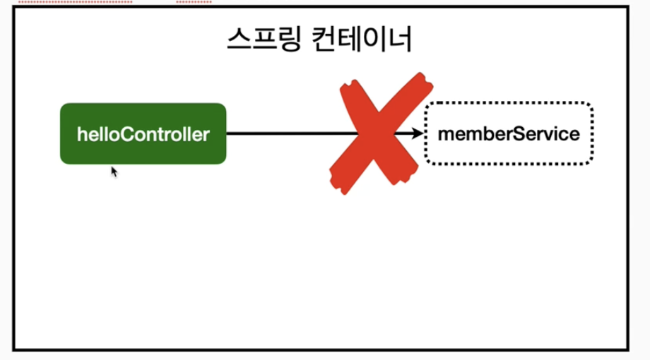
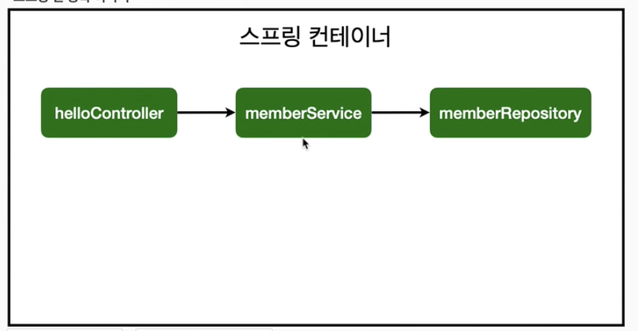

## 회원 컨트롤러에 의존관계 추가

```java
package hello.helloes.controller;

import hello.helloes.service.MemberService;
import org.springframework.beans.factory.annotation.Autowired;
import org.springframework.stereotype.Controller;

@Controller
public class MemberController {

    private final MemberService memberService;

    @Autowired
    public MemberController(MemberService memberService) {
        this.memberService = memberService;
    }
}
```

- 생성자에 `@Autowired`가 있으면 스프링이 연관된 객체를 스프링 컨테이너에서 찾아서 넣어준다. 이렇게 객체 의존 관계를 외부에서 넣어주는 것을 DI(Dependency Injection)의존성 주입이라 한다.
- 이전 테스트에서는 개발자가 직접 주입했고, 여기는 `@Autowired`에 의해 스프링 주입해준다.

### 오류 발생

> Consider defining a bean of type 'hello.helloes.service.MemberService' in your configuration.
> 

### memberService가 스프링 빈으로 등록되어 있지 않다.



> 참고 : `helloController`는 스프링이 제공하는 컨트롤러여서 스프링 빈으로 자동 등록된다.
> 

> `@Controller`가 있으면 자동 등록됨
> 

### 스프링 빈을 등록하는 2가지 방법

- 컴포넌트 스캔과 자동 의존관계 설정
- 자바 코드로 직접 스프링 빈 등록하기

### 컴포넌트 스캔과 자동 의존관계 설정

- `@Component`에노테이션이 있으면 스프링 빈으로 자동 등록된다.
- `@Controller`컨트롤러가 스프링 빈으로 자동 등록된 이유도 컴포넌트 스캔 때문이다.
- `@Component`를 포함하는 다음 에노테이션도 스프링 빈으로 자동 등록된다.
    - `@Controller`
    - `@Service`
    - `@Respository`

### 회원 리포지토리 스프링 빈 등록

```java
@Service
public class MemberService {

    private final MemberRespository memberRespository ;

    @Autowired
    public MemberService(MemberRespository memberRespository) {
        this.memberRespository = memberRespository;
    }
@Repository
public class MemberMemberRepository implements  MemberRespository {}
```

## 스프링 빈 등록 이미지



- `memberService` 와 `memberRepository` 가 스프링 컨테이너에 스프링 빈으로 등록되었다.

> 참고: 스프링은 스프링 컨테이너에 스프링 빈ㅇ르 등록할 때, 기본으로 싱글톤으로 등록한다.(유일하게 하나만 등록해서 공유한다) 따라서 같은 스프링 빈이면 모두 같은 인스턴스다. 설정으로 싱글톤이 아니게 설정할 수 있지만, 특별한 경우를 제외하면 대부분 싱글톤을 사용한다.
>