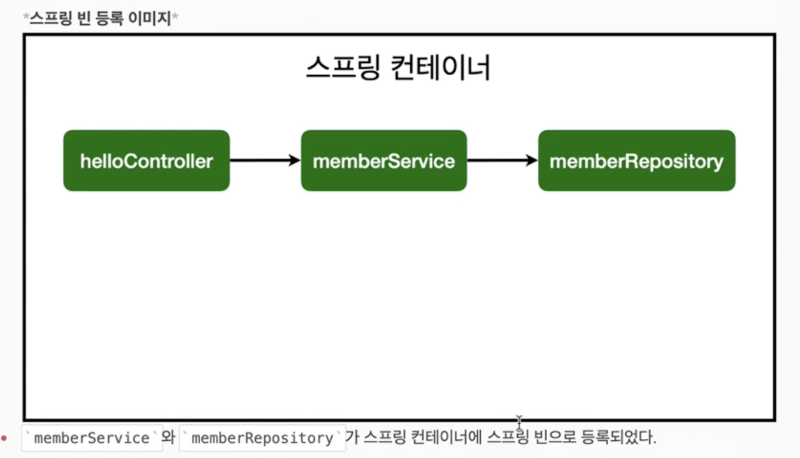
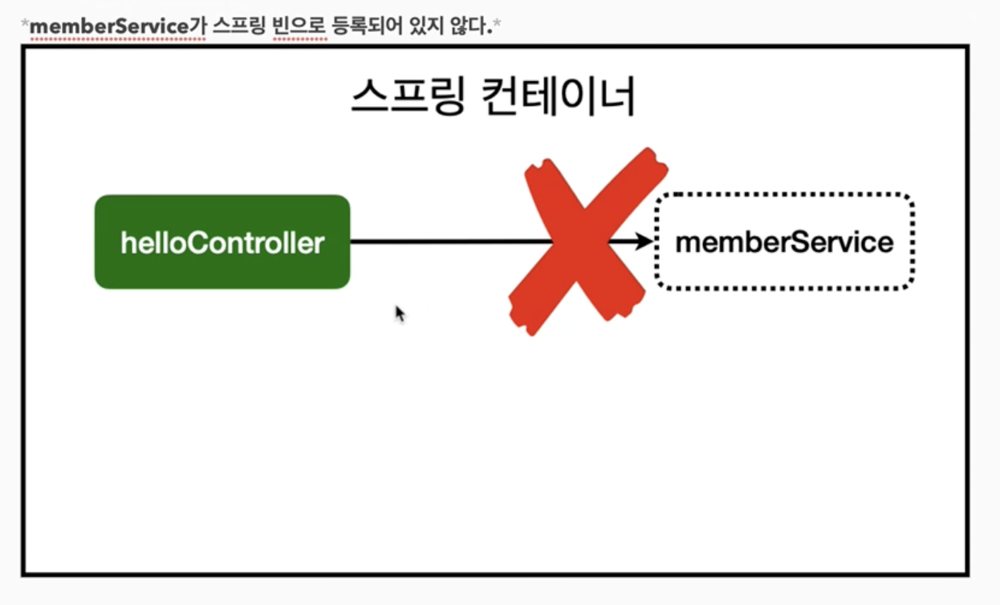

# 스프링 빈을 등록하고, 의존관계 설정하기

---

- 회원 컨트롤러가 회원서비스와 회원 리포지토리를 사용할 수 있게 의존관계를 준비하자.

### 회원 컨트롤러에 의존관계 추가

```java
package hello.hellospring.controller;

import hello.hellospring.service.MemberService;
import org.springframework.beans.factory.annotation.Autowired;
import org.springframework.stereotype.Controller;

@Controller
public class MemberController {
    private final MemberService memberService;
    @Autowired
    public MemberController(MemberService memberService) {
        this.memberService = memberService;
    }
}
```

- 생성자에 `‘@Autowired’`가 있으면 스프링이 연관된 객체를 스프링 컨테이너에서 찾아서 넣어준다.
    
    이렇게 객체 의존관계를 외부에서 넣어주는 것을 DI(Dependency Injection)의존성 주입이라고 한다.
    
- 이전 테스트에서는 개발자가 직접 주입했고, 여기서는 `@Autowired`에 의해 스프링이 주입해준다.

### 오류발생

<aside>
✔️ Consider defining a bean of type ‘hello.hellospring.service.MemberService’ in your configuration.

</aside>


참고: `helloController`는 스프링이 제공하는 컨트롤러여서 스프링 빈으로 자동 등록된다.

`‘@Controller’`가 있으면 자동 등록됨

### 스프링 빈을 등록하는 2가지 방법

- 컴포넌트 스캔과 자동 의존관계 설정
- 자바 코드로 직접 스프링 빈 등록하기

### 컴포넌트 스캔과 자동 의존관계 설정(hello.hellospring 하위 폴더만 가능)

- `‘@Component’` 애노테이션이 있으면 스프링 빈으로 자동 등록된다.
- `‘@Controller’` 컨트롤러가 스프링 빈으로 자동 등록된 이유도 컴포넌트 스캔 때문이다.
- `‘@Component’`를 포함하는 다음 애노테이션도 스프링 빈으로 자동 등록된다.
    - `‘@Controller’`
    - `‘@Service’`
    - `‘@Repository’`

### 회원 서비스 스프링 빈 등록

```java
@Controller
public class MemberController {
    private final MemberService memberService;
    @Autowired
    public MemberController(MemberService memberService) {
        this.memberService = memberService;
    }
}
```

생성자에 `‘@Autowired’` 를 사용하면 객체 생성 시점에 스프링 컨테이너에서 해당 스프링 빈을 찾아서 주입한다. 생성자가 1개만 있으면 `‘@Autowired’` 는 생략할 수 있다.

### 회원 리포지토리 스프링 빈 등록

```java
@Repository
public class MemoryMemberRepository implements MemberRepository{}
```



스프링은 스프링 컨테이너에 스프링 빈을 등록할 때, 기본적으로 싱글톤(유일)으로 한다.

(유일하게 하나만 등록해서 공유한다.)따라서 같은 스프링 빈이면 모두 같은 인스턴스다. 

설정으로 싱글톤이 아니게 설정할 수 있지만 특별한 경우를 제외하면 대부분 싱글톤을 사용한다.

# 이슈

---

### DI란 무엇인가

“A가 B를 의존한다.”는 표현은 어떤 의미일까? 추상적인 표현이지만, 토비의 스프링에서는 다음과 같이 정의한다.

> 의존대상 B가 변하면, 그것이 A에 영향을 미친다.
> 
> - *이일민, 토비의 스프링 3.1, 에이콘(2012), p113*

즉, B의 기능이 추가 또는 변경되거나 형식이 바뀌면 그 영향이 A에 미친다.

### **DI 장점**

그렇다면, DI, 의존 관계를 분리하여, 주입을 받는 방법의 코드 구현은 어떠한 장점이 있을까요?

**1. 의존성이 줄어든다.**

앞서 설명했듯이, 의존한다는 것은 그 의존대상의 변화에 취약하다는 것이다.(대상이 변화하였을 때, 이에 맞게 수정해야함) DI로 구현하게 되었을 때, 주입받는 대상이 변하더라도 그 구현 자체를 수정할 일이 없거나 줄어들게됨.

**2. 재사용성이 높은 코드가 된다.**

기존에 BurgerChef 내부에서만 사용되었던 BurgerRecipe을 별도로 구분하여 구현하면, 다른 클래스에서 재사용할 수가 있다.

**3. 테스트하기 좋은 코드가 된다.**

BurgerRecipe의 테스트를 BurgerChef 테스트와 분리하여 진행할 수 있다.

**4. 가독성이 높아진다.**

BurgerRecipe의 기능들을 별도로 분리하게 되어 자연스레 가동성이 높아진다.

### **정리**

DI(의존관계 주입)는 객체가 의존하는 또 다른 객체를 외부에서 선언하고 이를 주입받아 사용하는 것이다. 이를 구현함으로써 얻을 수 있는 장점들을 알아봤다.

자바와 관련된 서적이나, 스프링에 처음 입문하게 될 때, 자주 맞닥뜨리는 단어 DI. 용어의 늪에 빠지지 말고, 이 글을 통해 정리되었으면 한다.



### 스프링 빈이란

**`Spring IoC 컨테이너가 관리하는 자바 객체를 빈(Bean)`**이라고 부릅니다. 이전 포스팅에서 **제어의 역전 (IOC, Inversion Of Control)**에 대하여 간략하게 알아보았는데요. IOC의 특징은 아래와 같습니다.

• 일반적으로 처음에 배우는 자바 프로그램에서는 **각 객체들이 프로그램의 흐름을 결정하고 각 객체를 직접 생성하고 조작하는 작업(객체를 직접 생성하여 메소드 호출)을 했습니다**. 즉, 모든 작업을 사용자가 제어하는 구조였습니다. 예를 들어 A 객체에서 B 객체에 있는 메소드를 사용하고 싶으면, B 객체를 직접 A 객체 내에서 생성하고 메소드를 호출합니다.

• 하지만 **IOC가 적용된 경우, 객체의 생성을 특별한 관리 위임 주체에게 맡깁니다.** 이 경우 **사용자는 객체를 직접 생성하지 않고, 객체의 생명주기를 컨트롤하는 주체는 다른 주체**가 됩니다. 즉, 사용자의 제어권을 다른 주체에게 넘기는 것을 IOC(제어의 역전) 라고 합니다.

[http://melonicedlatte.com/2021/07/11/232800.html](http://melonicedlatte.com/2021/07/11/232800.html)