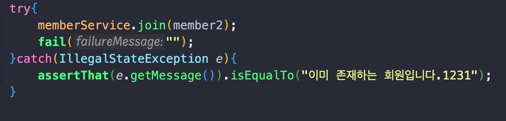
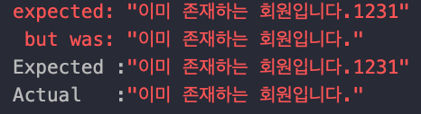

## 테스트 해야할 목록

---

### MemberServiceTest 클래스 객체 생성부

```java
MemberService memberService;
    MemoryMemberRepository memberRepository;

    @BeforeEach
    public void beforeEach(){
        memberRepository = new MemoryMemberRepository();
        memberService = new MemberService(memberRepository);
    }
```

- 외부에서 `memberRepository`를 `memberService`에 넣어주는 방법으로 객체를 생성하였다.

### MemberService 클래스에서 구현된 객체 생성부

```java
public MemberService(MemberRepository memberRepository) {//외부에서 넣어주도록 바꾸기 DI
        this.memberRepository = memberRepository;
    }
```

- 외부에서 넣어주는 DI 방법을 사용하였다.

### 외부에서 넣어주는 방법을 사용한 이유

```java
private static Map<Long, Member> store = new HashMap<>();
    private static long sequence = 0L;
```

- `MemoryMemberRepository` 클래스 구현부인데 `static`으로 생성해서 오류가 나지 않지만 만약 `static`으로 처리를 하지 않았다면, `sotore`를 공유했을 것이다.

### 회원가입

```java
@Test
    void 회원가입() { //테스트 코드는 한글로 써도 된다.
        //given 이러한 데이터를 가지고 사용
        Member member = new Member();
        member.setName("Spring");
        //when 이럴때?
        Long saveId = memberService.join(member);
        //then 검증부
        Member findMember = memberService.findOne(saveId).get();
        assertThat(member.getName()).isEqualTo(findMember.getName());
    }
```

1. 테스트를 위해 `Member` 객체를 생성 후 `setName()`메소드를 통해 이름저장
2. `Long`타입 `saveId` 변수를 통해 `memberService`의 `join()`메소드에 `member` 저장
3. `findMember` 생성 후 `memberService`의 `findOne()`메소드로 `saveId`와 같은 필드`get()`함
4. `assertThat()`으로 `member`의 이름이 `isEqualTo()`메소드로 `findMember`의 이름과 같으면 성공

### 중복 회원 예외처리

```java
@Test
    public void 중복_회원_예외(){
        //given
        Member member1 = new Member();
        member1.setName("Spring");

        Member member2 = new Member();
        member2.setName("Spring");
        //when
        memberService.join(member1);
        IllegalStateException e = assertThrows(IllegalStateException.class, () -> memberService.join(member2));
        assertThat(e.getMessage()).isEqualTo("이미 존재하는 회원입니다.");
```

1. 테스트를 위해 `member1`과 `member2`를 생성 후 이름을 동일하게 “Spring”으로 저장
2. `memberService`의 `join()`메소드를 통해 `member1` 먼저 저장
3. 중복을 검사하기 위해 `IllegalStateException.class` 를 사용하여 `memberService`에 `member2`를 저장하는데 중복이면 `e`에 저장
4. `assertThat()`으로 `e.getMessage()`의 메세지가 동일하면 성공
- try-catch사용해도 무방
    
   
    
- 예외처리를 보이기 위해 두에 1231추가
    
    
    

### Command + Shift + T 누르면 편하게 테스트 클래스를 만들 수 있다.

### 테스트 클래스는 메소드를 한글로 작성 해도 된다.

### 테스트 코드 메소드 구현부는 대부분 given, when, then 순으로 구현된다.