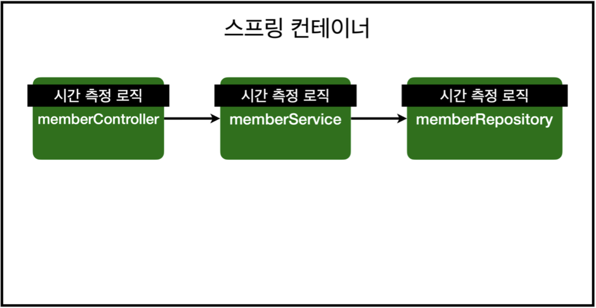

- 모든 메소드의 호출 시간을 측정하고 싶다면?
- 공통 관심 사항(cross-cutting concern) vs 핵심 관심 사항(core concern)
- 회원 가입 시간, 회원 조회 시간을 측정하고 싶다면?

---



### memberService 회원 조회 시간 측정 추가

---

```java
package hello.hellospring.service;

import hello.hellospring.domain.Member;
import hello.hellospring.repository.MemberRepository;
import org.springframework.transaction.annotation.Transactional;

import java.util.List;
import java.util.Optional;
@Transactional
public class MemberService {

    private final MemberRepository memberRepository;

    public MemberService(MemberRepository memberRepository) {//외부에서 넣어주도록 바꾸기 DI
        this.memberRepository = memberRepository;
    }

    //회원 가입
    public Long join(Member member){
        long start = System.currentTimeMillis();
        try {
            validateDuplicateMember(member);//중복 회원 검증
            memberRepository.save(member);
            return member.getId();
        }finally {
            long finish = System.currentTimeMillis();
            long timeMs = finish -start;
            System.out.println("join = " +timeMs+ "ms" );
        }
    }

    private void validateDuplicateMember(Member member) {
        memberRepository.findByName(member.getName())
                .ifPresent(m->{
                    throw new IllegalStateException("이미 존재하는 회원입니다.");
                });
    }
    //회원 조회
    public List<Member> findMembers(){
        long start = System.currentTimeMillis();
        try{
            return memberRepository.findAll();
        }finally {
            long finish = System.currentTimeMillis();
            long timeMs = finish -start;
            System.out.println("findmembers = " +timeMs+ "ms" );
        }

    }
    public Optional<Member> findOne(Long memberId){
        return memberRepository.findById(memberId);
    }
}
```

### **문제**

- 회원가입, 회원 조회에 시간을 측정하는 기능은 핵심 관심 사항이 아니다.
- 시간을 측정하는 로직은 공통 관심 사항이다.
- 시간을 측정하는 로직과 핵심 비즈니스의 로직이 섞여서 유지보수가 어렵다.
- 시간을 측정하는 로직을 별도의 공통 로직으로 만들기 매우 어렵다.
- 시간을 측정하는 로직을 변경할 때 모든 로직을 찾아가면서 변경해야 한다.