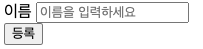

# 회원 등록 폼 개발

---

### home출력


### 회원 등록 폼 컨트롤러

```html
<!DOCTYPE HTML>
<html xmlns:th ="http://www.thymeleaf.org">
<body>

<div class ="container">
    <form action ="/members/new" method="post">
        <div class = "form-group">
            <label for="name">이름</label>
            <input type = "text" id = "name" name="name" placeholder="이름을 입력하세요">
        </div>
        <button type ="submit">등록</button>
    </form>
</div>
</body>
</html>
```

# MemberController에 Mapping

```java
package hello.hellospring.controller;

import hello.hellospring.domain.Member;
import hello.hellospring.service.MemberService;
import org.springframework.beans.factory.annotation.Autowired;
import org.springframework.stereotype.Controller;
import org.springframework.web.bind.annotation.GetMapping;
import org.springframework.web.bind.annotation.PostMapping;

@Controller
public class MemberController {
    private MemberService memberService;
    @Autowired
    public MemberController(MemberService memberService) {
        this.memberService = memberService;
    }

    @GetMapping("/members/new")
    public String createForm(){
        return "members/createMemberForm";
    }
    @PostMapping("members/new")
    public String create(MemberForm form){
        Member member = new Member();
        member.setName(form.getName());

        memberService.join(member);
        return "redirect:/";
    }
}
```

### MemberForm 클래스

```java
package hello.hellospring.controller;

public class MemberForm {
    private String name;

    public String getName() {
        return name;
    }

    public void setName(String name) {
        this.name = name;
    }
}
```

- 텍스트 박스에 입력된 이름을 저장 후 `getName()`으로 가져 오거나 `setName()`으로 저장할 수 있다.
    
    
    

# 이슈

---

GetMapping,PostMapping 등 차이점


- [@GetMapping](https://docs.spring.io/spring-framework/docs/current/javadoc-api/org/springframework/web/bind/annotation/GetMapping.html) : GET 요청을 하는 API의 어노테이션.
    - 데이터를 가져올 때 사용한다.
- [@PostMapping](https://docs.spring.io/spring-framework/docs/current/javadoc-api/org/springframework/web/bind/annotation/PostMapping.html) : POST 요청을 하는 API의 어노테이션
    - 데이터를 게시할 때 사용한다.
- [@PutMapping](https://docs.spring.io/spring-framework/docs/current/javadoc-api/org/springframework/web/bind/annotation/PostMapping.html) : PUT 요청을 하는 API의 어노테이션
    - 데이터를 수정할 때 사용한다.
- [@DeleteMapping](https://docs.spring.io/spring-framework/docs/current/javadoc-api/org/springframework/web/bind/annotation/DeleteMapping.html) : DELETE 요청을 하는 API의 어노테이션
    - 데이터를 삭제할 때 사용한다.
- [@PatchMapping](https://docs.spring.io/spring-framework/docs/current/javadoc-api/org/springframework/web/bind/annotation/PatchMapping.html) : PATCH 요청을 하는 API의 어노테이션
    - 데이터를 수정할 때 사용한다.
    
    *`PUT`과 `PATCH`가 데이터를 수정한다는 측면에서는 비슷하나, `PUT`이 데이터 전체를 갱신하는 HTTP 메서드라면, `PATCH`는 수정하는 영역만 갱신하는 HTTP 메서드이다.*