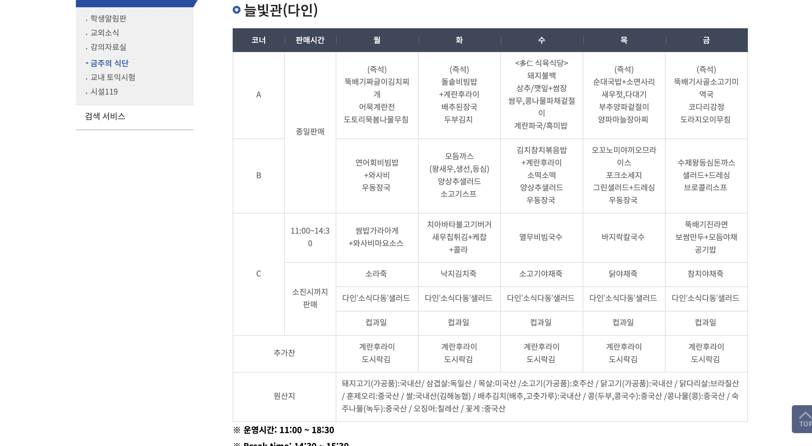
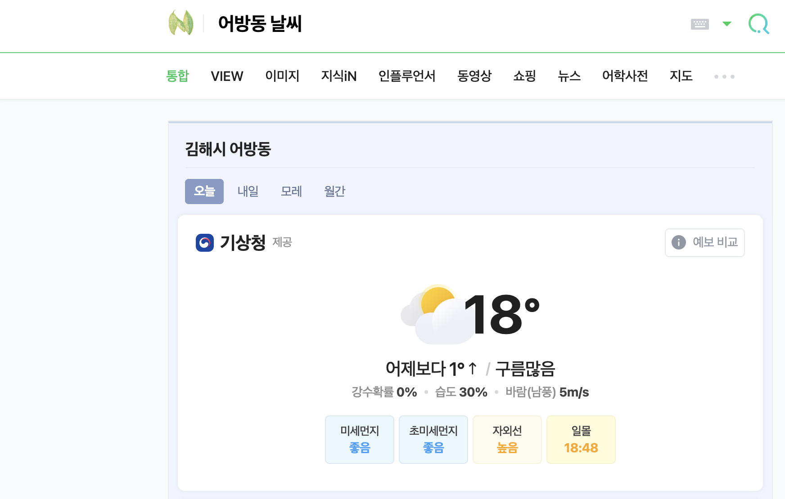
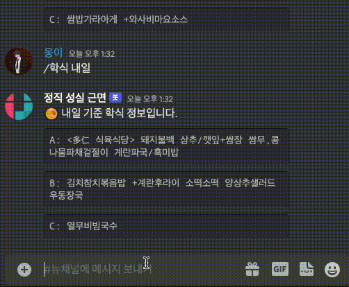

# DiscordBot-InjeCrawler
### 인제대 디스코드 봇으로 학식 크롤링과 어방동 날씨를 가져오는 봇입니다.

 
# STACK

   

## Command1: /학식
### 당일 학식을 Beautifulsoup를 사용하여 가져옵니다
 

### 동작 영상
     

## Command2: /날씨
### 당일 날씨를 Beautifulsoup를 사용하여 가져옵니다
 

### 동작 영상
    

## Crawler: 1000초에 한번씩 업데이트하는 공지 크롤러 봇
 