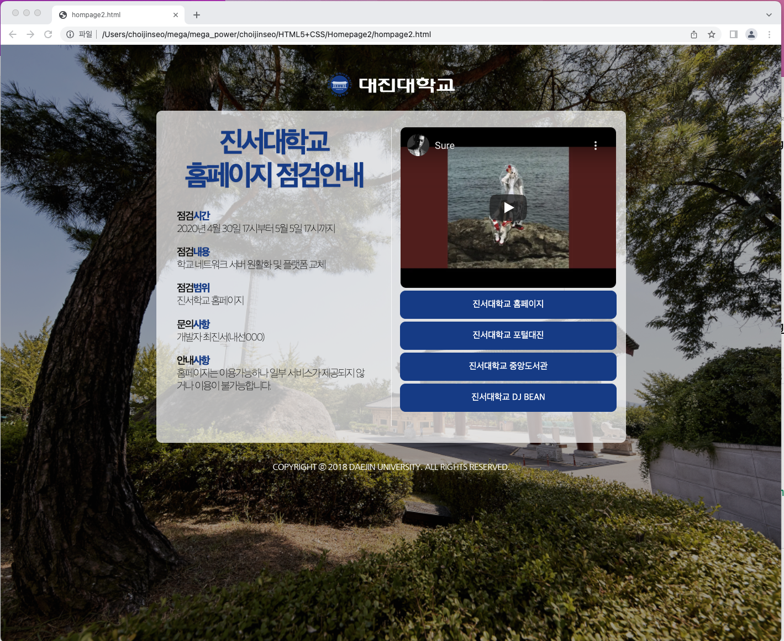

<h1>Homepage2</h1>

```html
<!DOCTYPE html>
<html>
    <head>
        <title></title>
        <link href = "/Users/choijinseo/mega/mega_power/choijinseo/HTML5+CSS/Homepage2/style/default.css" rel="stylesheet">
    </head>
    <body>
        
        <div class="imsi-sub-frame">
            <div class="imsi-left">
               <div>
                <p class="imsi-title">진서대학교</p>
                <p class="imsi-title">홈페이지 점검안내</p>
               </div>
               <div class="imsi-left-content-frame">
                   <p class="imsi-category" style="margin-top: 30px;">점검<span class="point">시간</span></p>
                   <p class="imsi-text">2020년 4월 30일 17시부터 5월 5일 17시까지</p>
                   <p class="imsi-category">점검<span class="point">내용</span></p>
                   <p class="imsi-text">학교 네트워크 서버 원활화 및 플랫폼 교체</p>
                   <p class="imsi-category">점검<span class="point">범위</span></p>
                   <p class="imsi-text">진서학교 홈페이지</p>
                   <p class="imsi-category">문의<span class="point">사항</span></p>
                   <p class="imsi-text">개발자 최진서(내선000)</p>
                   <p class="imsi-category">안내<span class="point">사항</span></p>
                   <p class="imsi-text">홈페이지는 이용가능하나 일부 서비스가 제공되지 않거나 이용이 불가능합니다.</p>
               </div>
            </div>
            <div class="imsi-right">
                <iframe width="390" height="290" src="https://www.youtube.com/embed/c99vwrDUafE" title="YouTube video player" frameborder="0" allow="accelerometer; autoplay; clipboard-write; encrypted-media; gyroscope; picture-in-picture" allowfullscreen style="border-radius: 10px"></iframe>
                <a href="#"><div class="imsi-button">진서대학교 홈페이지</div></a>
                <a href="#"><div class="imsi-button">진서대학교 포털대진</div></a>
                <a href="#"><div class="imsi-button">진서대학교 중앙도서관</div></a>
                <a href="#"><div class="imsi-button">진서대학교 DJ BEAN</div></a>
             </div>
        </div>
        
    </body>
</html>
```

```css
body {
    text-align: center;
    padding: 0;
    margin: 0;
    background-image: url('/Users/choijinseo/mega/mega_power/choijinseo/HTML5+CSS/Homepage2/img/IMSI_Background.png');
    background-size: cover;
    background-repeat: no-repeat;
    background-position: center;
    background-attachment: fixed;
}

.logo {
    margin-top: 50px;
}

.imsi-sub-frame {
    position: relative;
    width: 850px;
    height: 600px;
    background-color: rgba(255, 255, 255, 0.7);
    border-radius: 10px;
    margin-left: auto;
    margin-right: auto;
    margin-top: 20px;
}

.copyright {
    margin-top: 20px;
}

@import url(http://fonts.googleapis.com/earlyacccess/notosanskr.css);

a {
    text-decoration: none;
}

.imsi-title {
    color:#003c8a;
    font-weight: 700;
    font-size: 3.2em;
    letter-spacing: -0.1em;
}

.imsi-category {
    margin-top: 10px;
    text-align: left;
    font-weight: 500;
    font-size: 1.2em;
    letter-spacing: -0.1em;
    margin: 0;
}

.imsi-text {
    margin-top: 0;
    text-align: left;
    font-weight: 300;
    font-size: 1.2em;
    letter-spacing: -0.1em;
}

.point {
    font-weight: 900;
    color: #003c8a;
}

p:not(.imsi-text):not(.imsi-category) {
    margin: 0;
    line-height: 60px;
    text-shadow: 0px 1px 2px rgba(0, 0, 0, 0.1);
}

.imsi-left {
    margin-top: 30px;
    position: absolute;
    left: 0;
    width: 425px;
    height: 540px;
    border-right: 1px solid rgba(255, 255, 255, 0.7);
}
.imsi-left-content-frame {
    margin: 0 auto;
    width: 350px;
}

.imsi-right {
    margin-top: 30px;
    position: absolute;
    right: 0;
    width: 425px;
    height: 540px;
}

.imsi-button {
    margin: 0 auto;
    color: white;
    border: 1px solid #003c8a;
    background-color: #003c8a;
    text-align: center;
    padding-top: 15px;
    padding-bottom: 15px;
    width: 390px;
    transition: 0.2s;
    border-radius: 10px;
    margin-bottom: 5px;
}

.imsi-button:hover {
    border: 1px solid #0a1b7a;
    background-color: #0a1b7a;
}
```
