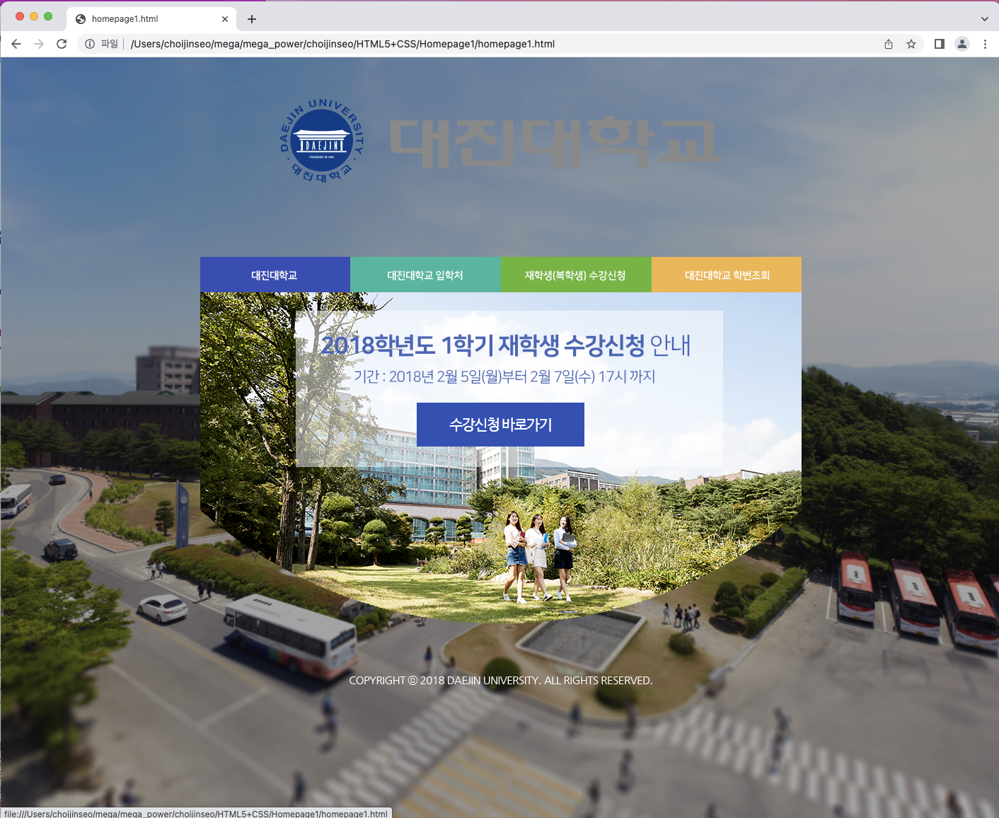

<h1>homepage1</h1>

```html
<!DOCTYPE html>
<html>
    <head>
        <title></title>
        <link href="./style/default.css" rel="stylesheet">
    </head>
    <body>
      <div class="main-frame">
        
        <div class="menu">
            <a href="#"></a>
            <a href="#"></a>
            <a href="#"></a>
            <a href="#"></a>
        </div>
        <a href=""></a>
        
      </div>  
    </body>
</html>
```

```css
body {
    background-image: url("/Users/choijinseo/mega/mega_power/choijinseo/HTML5+CSS/Homepage1/img/DAEJIN_Background2.png");
    background-size: cover;
    background-position: center;
    background-repeat: no-repeat;
    background-attachment: fixed;
}

.main-frame {
    text-align: center;
    width: 850px;
    margin-left: auto;
    margin-right: auto;
}

#logo {
    margin-top: 50px;
    margin-bottom: 50px;
}

.menu {
    margin-top: 50px;
}

.menu-img {
    float: left;
}

.copyright {
    margin-top: 50px;
}
```

