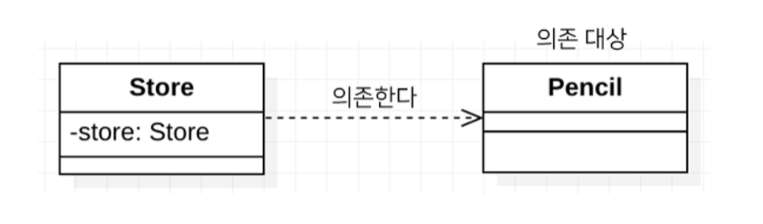

<h1>자바 코드로 직접 스프링 빈 등록하기</h1>
- 회원 서비스와 회원 리포지토리(`@Service`,`@Respository`,`@Autowired`에노테이션을 제거하고 진행한다.

```java
package hello.helloes.service;

import hello.helloes.domain.Member;
import hello.helloes.repository.MemberMemberRepository;
import hello.helloes.repository.MemberRespository;
import org.springframework.context.annotation.Bean;
import org.springframework.context.annotation.Configuration;

@Configuration
public class SpringCofig {

    @Bean
    public MemberService memberService() {
        return new MemberService(memberRespository());
    }

    @Bean
    public MemberRespository memberRespository() {
        return new MemberMemberRepository();
    }
}
```

### 여기서는 향후 메모리 리포지토릴를 다른 리포지토리로 변경할 예정이므로, 컴포넌트 스캔 방식 대신에 자바 코드로 스프링 빈을 설정하였다.

> 참고 : XML로 설정하는 방식도 있지만 최근에는 잘 사용하지 않으므로 생략한다.
> 

> 참고 : DI에는 필드주입, setter주입, 생성자 주입 이렇게 3가지 방법이 있다. 의존관계가 실행중에 동적으로 변하는 경우는 거의 없으므로 생성자 주입을 권장한다.
> 

> 참고 : 실무에서는 주로 정형화된 컨트롤러,서비스, 리포지토리 같은 코드는 컴포넌트 스캔을 사용한다. 그리고 정형화 되지 않거나, 상황에 따라 구현 클래스를 변경해야 하면 설정을 통해 스프링 빈으로 등록
> 

<aside>
💡 주의 : `@Autowired`를 통한 DI는 `helloController`,`MemberService`등과 같은 스프링 관리하는 객체에서만 동작한다. 스프링 빈으로 등록하지 않고 내가 직접 생성한 객체에서는 동작하지 않는다.

</aside>

- DI(Dependency Injection)
    
    외부에서 두 객체 간의 관계를 결정해주는 디자인 패턴으로, 인터페이스를 사이에 둬서 클래스 레벨에서는 의존관계가 고정되지 않도록 하고 런타임 시에 관계를 다이나믹하게 주입하여 유연성을 확보하고 결합도를 낮출 수 있게 해준다.
    
    ```java
    public class Store {
    	private Pencil pencil;
    }
    ```
    
    
    
    - 출처 : [https://mangkyu.tistory.com/150](https://mangkyu.tistory.com/150)
- Bean
    
    Spring IoC 컨테이너가 관리하는 자바 객체를 빈(Bean)이라는 용어로 부른다.