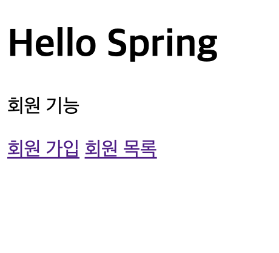
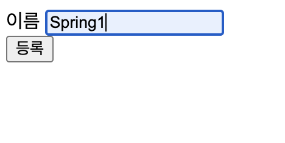
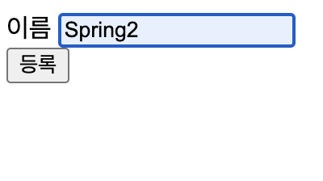
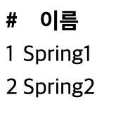

<h1>회원 관리 예제 - 웹 MVC 개발</h1>

# 회원 웹 기능 - 홈 화면 추가

- 홈 컨트롤러 추가

```java
package hello.helloes.controller;

import org.springframework.stereotype.Controller;
import org.springframework.web.bind.annotation.GetMapping;

@Controller
public class HomeController {

    @GetMapping("/")
    public String home() {
        return "home";
    }
}
```

- 회원 관리용 홈

```html
<!DOCTYPE html>
<html xmlns:th="http://www.thymeleaf.org">
<body>

<div class="container">
    <div>
        <h1> Hello Spring</h1>
        <p>회원 기능</p>
        <p>
            <a href="/members/new">회원 가입</a>
            <a href="/members">회원 목록</a>
        </p>
    </div>
</div>

</body>
</html>
```

# 회원 웹 기능 - 등록

- 회원 등록 폼 컨트롤러

```java
package hello.helloes.controller;

import hello.helloes.domain.Member;
import hello.helloes.service.MemberService;
import org.springframework.beans.factory.annotation.Autowired;
import org.springframework.stereotype.Controller;
import org.springframework.web.bind.annotation.GetMapping;
import org.springframework.web.bind.annotation.PostMapping;

@Controller
public class MemberController {

    private final MemberService memberService;

    @Autowired
    public MemberController(MemberService memberService) {
        this.memberService = memberService;
    }

    @GetMapping("/members/new")
    public String creatFore() {
        return "members/createMemberForm";
    }

    @PostMapping("/members/new")
    public String create(MemberForm form) {
        Member member = new Member();
        member.setName(form.getName());

        System.out.println("member = " + member.getName());

        memberService.join(member);

        return "redirect:/";
    }
}
```

- 회원 폼

```java
package hello.helloes.controller;

public class MemberForm {
    private String name;

    public String getName() {
        return name;
    }

    public void setName(String name) {
        this.name = name;
    }
}
```

- 회원 등록 폼 HTML

```html
<!DOCTYPE html>
<html xmlns:th="http://www.thyleaf.org">
<body>
<div class="container">

  <form action="/members/new" method="post">
    <div class="form-group">
      <label for="name">이름</label>
      <input type="text"  id="name"  name="name" placeholder="이름을 입력하세요">
    </div>
    <button type="submit">등록</button>
  </form>
</div>
</body>
</html>
```

# 회원 웹 기능 - 조회

- 회원 컨트롤러에서 조회 가능

```java
package hello.helloes.controller;

import hello.helloes.domain.Member;
import hello.helloes.service.MemberService;
import org.springframework.beans.factory.annotation.Autowired;
import org.springframework.stereotype.Controller;
import org.springframework.ui.Model;
import org.springframework.web.bind.annotation.GetMapping;
import org.springframework.web.bind.annotation.PostMapping;
import org.thymeleaf.model.IAttribute;

import java.util.List;

@Controller
public class MemberController {

    private final MemberService memberService;

    @Autowired
    public MemberController(MemberService memberService) {
        this.memberService = memberService;
    }

    @GetMapping("/members/new")
    public String creatFore() {
        return "members/createMemberForm";
    }

    @PostMapping("/members/new")
    public String create(MemberForm form) {
        Member member = new Member();
        member.setName(form.getName());

        System.out.println("member = " + member.getName());

        memberService.join(member);

        return "redirect:/";
    }

    @GetMapping("/members")
    public String list(Model model) {
        List<Member> members = memberService.findMembers();
        model.addAttribute("members", members);
        return "members/memberList";
    }
}
```

- 회원 리스트 HTML

```html
<!DOCTYPE html>
<html xmlns:th="http://www.thymeleaf.org">
<body>
<div class = "container">
  <div>
    <table>
      <thead>
        <tr>
          <th>#</th>
          <th>이름</th>
        </tr>
      </thead>
      <tbody>
        <tr th:each="member : ${members}">
          <td th:text="${member.id}"></td>
          <td th:text="${member.name}"></td>
        </tr>
      </tbody>
    </table>
  </div>
</div>
</body>
</html>
```

- GetMapping은 메소드에서만 적용
    - HTTP GET 요청을 특정 핸들러 메소드에 맵핑하기위한 annotation.
    - 주소에 파라미터가 노출 됨.
- PostMapping
    - 어노테이션이있는 메소드는 **주어진 URI 표현식과 일치하는 HTTP POST 요청을 처리**
    합니다.
- 구현
    
    
    
    
    
    
    
    