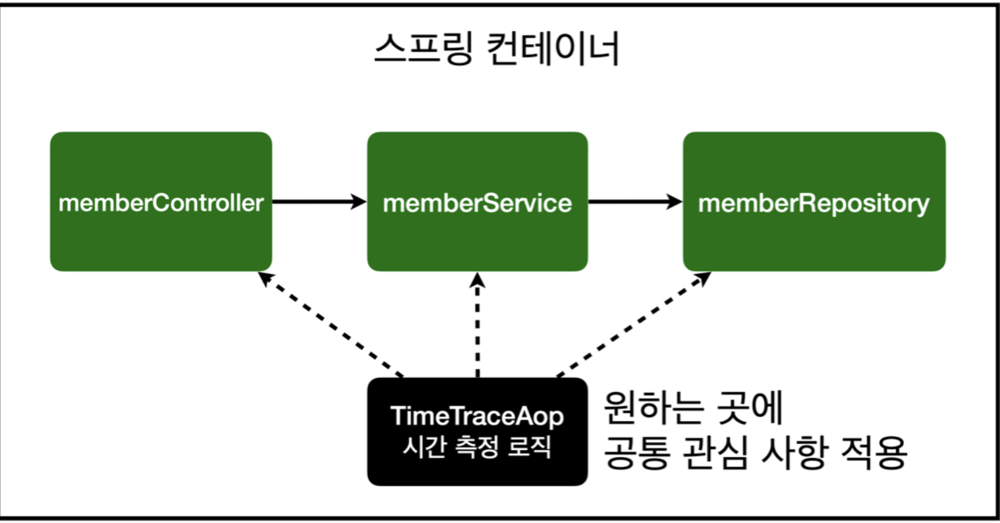
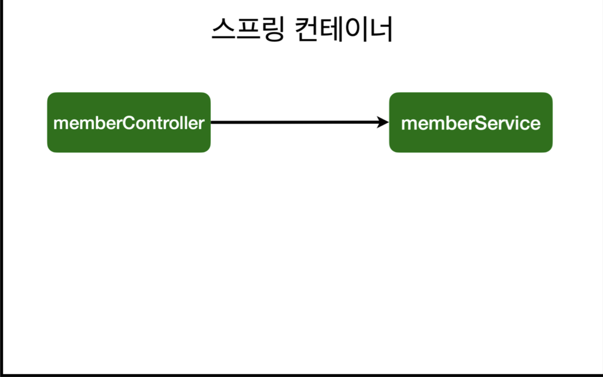
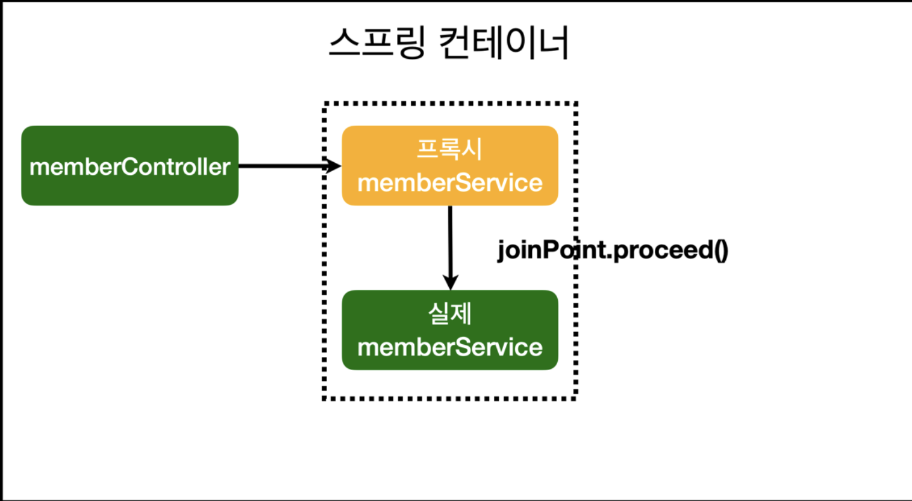
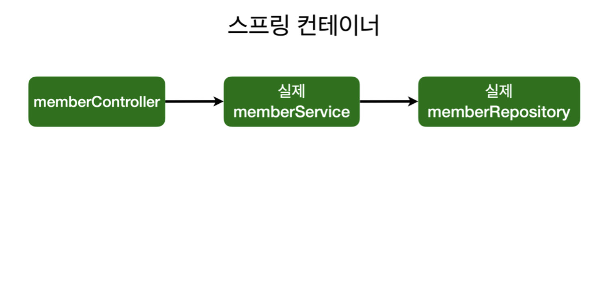
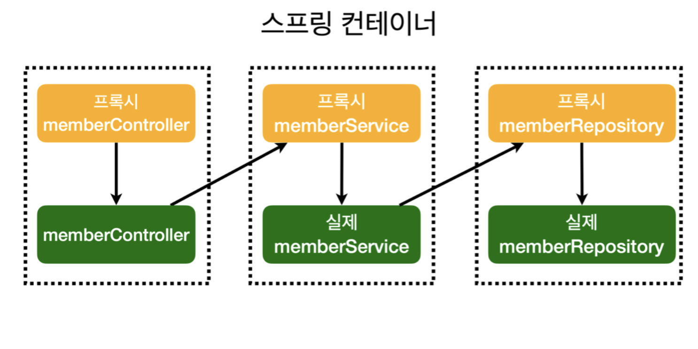

### AOP: Aspect Oriented Programming

- 공통 관심 사항(cross-cutting concern) vs 핵심 관심 사항(core concern) 분리



### 시간 측정 AOP 등록

---

```java
package hello.hellospring.aop;

import org.aspectj.lang.ProceedingJoinPoint;
import org.aspectj.lang.annotation.Around;
import org.aspectj.lang.annotation.Aspect;
import org.springframework.stereotype.Component;

@Aspect
@Component
public class TimeTraceAop {
    @Around("execution(* hello.hellospring..*(..))")
    public Object excute(ProceedingJoinPoint joinPoint)throws Throwable{
        long start = System.currentTimeMillis();
        System.out.println("START = " + joinPoint.toString());
        try {
            return joinPoint.proceed();//inline
        }finally {
            long finish = System.currentTimeMillis();
            long timeMs = finish -start;
            System.out.println("END = " + joinPoint.toString()+ " "+ timeMs+"ms");
        }
    }
}
```

### 해결

- 회원가입, 회원 조회등 핵심 관심사항과 시간을 측정하는 공통 관심 사항을 분리한다.
- 시간을 측정하는 로직을 별도의 공통 로직으로 만들었다.
- 핵심 관심 사항을 깔끔하게 유지할 수 있다.
- 변경이 필요하면 이 로직만 변경하면 된다.
- 원하는 적용 대상을 선택할 수 있다.

### 동작 설명

---

AOP 적용 전 의존관계



AOP적용 후 의존관계



AOP적용 전 전체 그림



AOP적용 후 전체 그림

