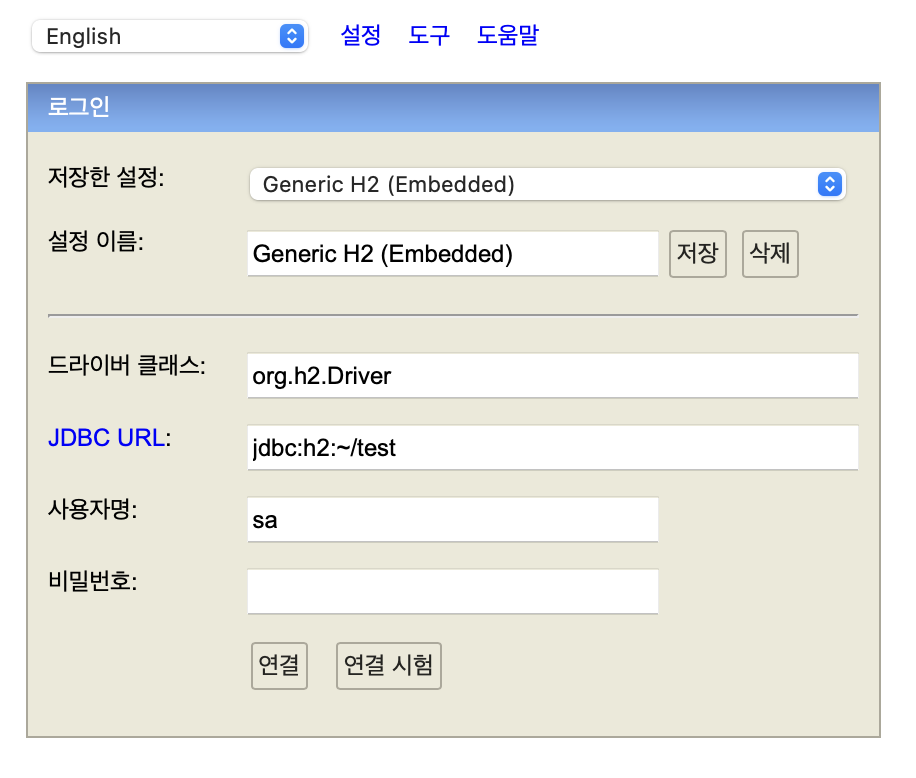

# 스프링 데이터 엑세스

---

### H2 데이터베이스 설치

개발이나 테스트 용도로 가볍고 편리한 DB,웹 화면 제공

- [https://www.h2database.com](https://www.h2database.com)
- 다운로드 및 설치
- h2 데이터베이스 버전은 스프링 부트 버전에 맞춘다.
- 실행 : `./h2.sh`
- 데이터베이스 파일 생성 방법
    - `jdbc:h2~/test` (최초 한번)
    - `~/test.mv.db` 파일 생성 확인
    - 이후부터는 `jdbc:h2:tcp://localhost/~/test` 이렇게 접속
        
        
        


        
        맥 사용자는 권한을 부여해야한다
        
        
        
        생성된 test.mv.db 모습
        

### 테이블 생성하기

테이블 관리를 위해 프로젝트 루트에 `sql/ddl.sql` 파일을 생성



DB에 `id`와 `name` 받는 코드

```sql
drop table if exists member CASCADE;
create table member
(
	id bigint generated by default as identity,
	name varchar(255),
	primary key(id)
);
```


생성된 MEMBER 조회하기

```sql
select * from member;
```


 DB에 `id`와 `name` 넣기

```sql
insert into member(name) values('spring')
```


생성된 id와 name