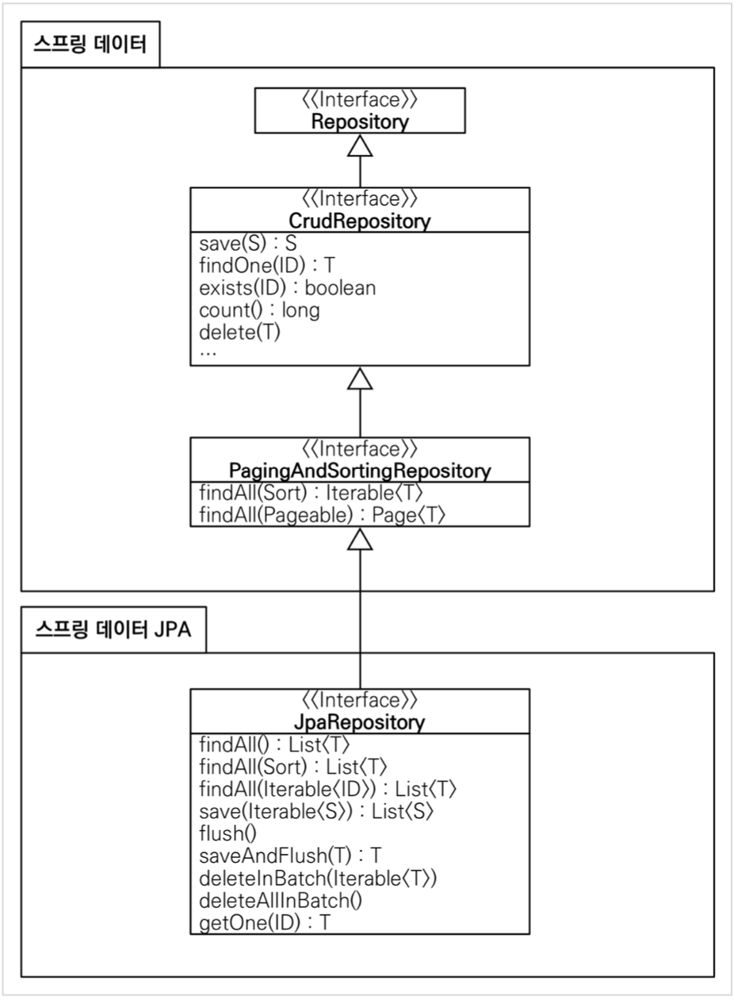

스프링 부트와 `JPA`만 사용해도 개발 생산성이 정말 많이 증가하고, 개발해야할 코드도 확연히 줄어듭니다. 

여기에 스프링 데이터 `JPA`를 사용하면, 기존의 한계를 넘어 마치 마법처럼, 리포지토리에 구현 클래스 없이 인터페이스 만으로 개발을 완료할 수 있습니다. 

그리고 반복 개발해온 기본 CRUD 기능도 스프링 데이터 `JPA`가 모두 제공합니다.
스프링 부트와 `JPA`라는 기반 위에, 스프링 데이터 `JPA`라는 환상적인 프레임워크를 더하면 개발이 정말 즐거워집니다. 

지금까지 조금이라도 단순하고 반복이라 생각했던 개발 코드들이 확연하게 줄어듭니다.

따라서 개발자는 핵심 비즈니스 로직을 개발하는데, 집중할 수 있습니다.
실무에서 관계형 데이터베이스를 사용한다면 스프링 데이터 `JPA`는 이제 선택이 아니라 필수 입니다.

> 주의: **스프링 데이터 `JPA`는 `JPA`를 편리하게 사용하도록 도와주는 기술입니다. 따라서 `JPA`를 먼저 학습한
후에 스프링 데이터 `JPA`를 학습해야 합니다.**

앞의 `JPA` 설정을 그대로 사용한다.

### **스프링 데이터 `JPA` 회원 리포지토리**

---

```java
package hello.hellospring.repository;
    import hello.hellospring.domain.Member;
    import org.springframework.data.jpa.repository.JpaRepository;
    import java.util.Optional;
    public interface SpringDataJpaMemberRepository extends JpaRepository<Member,
    Long>, MemberRepository {
        Optional<Member> findByName(String name);
    }
```

### **스프링 데이터 `JPA` 회원 리포지토리를 사용하도록 스프링 설정 변경**

---

```java
package hello.hellospring.service;

import hello.hellospring.repository.MemberRepository;
import org.springframework.context.annotation.Bean;
import org.springframework.context.annotation.Configuration;

@Configuration
public class SpringConfig {
    private final MemberRepository memberRepository;

    public SpringConfig(MemberRepository memberRepository) {
        this.memberRepository = memberRepository;
    }
/*
    private EntityManager em;
    @Autowired
    public SpringConfig(EntityManager em) {
        this.em = em;
    }
*/
    @Bean
    public MemberService memberService(){

        return new MemberService(memberRepository);
    }
   /* @Bean
    public MemberRepository memberRepository(){
       //return new JdbcTemplateMemberRepository(dataSource);
        return new JpaMemberRepository(em);
    }*/
}
```

- 스프링 데이터 `JPA`가 `SpringDataJpaMemberRepository` 를 스프링 빈으로 자동 등록해준다.

### **스프링 데이터 JPA 제공 클래스**

---



### **스프링 데이터 `JPA` 제공 기능**

---

- 인터페이스를 통한 기본적인 CRUD
- `findByName()` , `findByEmail()` 처럼 메서드 이름 만으로 조회 기능 제공
- 페이징 기능 자동 제공

참고: 

실무에서는 `JPA`와 스프링 데이터 `JPA`를 기본으로 사용하고, 복잡한 동적 쿼리는 `Querydsl`이라는 라이브러리를 사용하면 된다. 

`Querydsl`을 사용하면 쿼리도 자바 코드로 안전하게 작성할 수 있고, 동적 쿼리도 편리하게 작성할 수 있다. 

이 조합으로 해결하기 어려운 쿼리는 `JPA`가 제공하는 네이티브 쿼리를 사용하거나, 앞서 학습한 스프링 `JdbcTemplate`를 사용하면 된다.