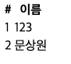

# 회원 컨트롤러에서 조회 가능

---

```java
@GetMapping("/members")
    public String list(Model model){
        List<Member> members = memberService.findMembers();
        model.addAttribute("members",members);
        return "members/memberList";
    }
```

- `members.findMembers()` 로 등록된 `member`의 정보를 받아와서 `List`형태로 저장
- `model`로 `key`,`value`로 값을 전달
- `template`에 `memberList`에 인자전달

### 회원 리스트HTML

---

```html
<!DOCTYPE HTML>
<html xmlns:th="http://thymeleaf.org">
<body>
<div class = "container">
    <div>
        <table>
            <thead>
            <tr>
                <th>#</th>
                <th>이름</th>
            </tr>
            </thead>
            <tbody>
            <tr th:each="member : ${members}">
                <td th:text="${member.id}"></td>
                <td th:text="${member.name}"></td>
            </tr>
            </tbody>
        </table>
    </div>
</div>
</body>
```

- `members`의 `id` 값과 `name`값을 출력하는 HTML소스
    
    
    
    회원 등록하기
    
    회원 조회하기
    

## 이슈

---

### Model 객체란?

`Model`은 `HashMap` 형태를 갖고 있으며, `key`, `value`값을 가지고 있습니다.

`Controller`의 메서드는 `Model`이라는 타입의 객체를 파라미터로 받을 수 있다.

편리한 점은 개발자는 직접 `model`을 생성할 필요는 없다. 다만 파라미터로 선언만 해주면 스프링이 알아서 만들어준다.

**전달될 때는 클래스명의 앞글자를 소문자로 처리하여 전달한다.**

전달방법)

1. 파라미터에 `Model`타입의 객체를 선언. 이후 `addAttribute()`를 통해 전달
2. `@ModelAttribute` 어노테이션 사용